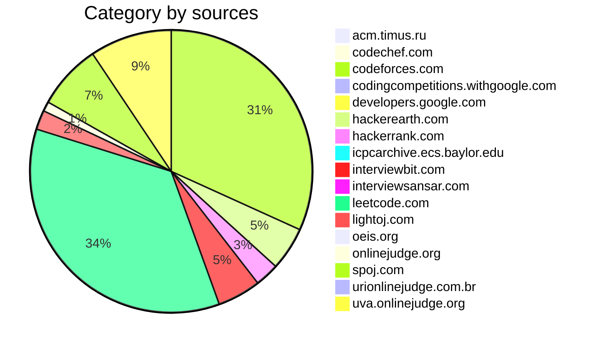

# Problems-Solving
My implementation of useful data structures, algorithms, as well as my solutions to programming puzzles.
```java
Number of problems : 374
- acm.timus.ru : 1
- codechef.com : 2
- codeforces.com : 115
- codingcompetitions.withgoogle.com : 1
- developers.google.com : 1
- hackerearth.com : 18
- hackerrank.com : 10
- icpcarchive.ecs.baylor.edu : 3
- interviewbit.com : 18
- interviewsansar.com : 1
- leetcode.com : 128
- lightoj.com : 8
- oeis.org : 1
- onlinejudge.org : 4
- spoj.com : 27
- urionlinejudge.com.br : 2
- uva.onlinejudge.org : 34
```

### #01knapsack (3)
- [x] DividingCoins [(java)](./Java/DividingCoins.java)
- [x] DivingForGold [(java)](./Java/DivingForGold.java)
- [x] PoloPenguinAndTest [(java)](./Java/PoloPenguinAndTest.java)
### #ad-hoc-1 (3)
- [x] MMass [(java)](./Java/MMass.java)
- [x] StreetParade [(java)](./Java/StreetParade.java)
- [x] Test [(java)](./Java/Test.java)
### #array (38)
- [x] CheckIfItIsAStraightLine [(java)](./Java/CheckIfItIsAStraightLine.java)
- [x] CombinationSumII [(java)](./Java/CombinationSumII.java)
- [x] ConstructBinaryTreeFromInorderAndPostorderTraversal [(java)](./Java/ConstructBinaryTreeFromInorderAndPostorderTraversal.java)
- [x] ConstructBinaryTreeFromPreorderAndInorderTraversal [(java)](./Java/ConstructBinaryTreeFromPreorderAndInorderTraversal.java)
- [x] CountSquareSubmatricesWithAllOnes [(java)](./Java/CountSquareSubmatricesWithAllOnes.java)
- [x] CountingElements [(java)](./Java/CountingElements.java)
- [x] FindDuplicateInArray [(java)](./Java/FindDuplicateInArray.java)
- [x] FindtheDuplicateNumber [(cpp)](./C++/FindtheDuplicateNumber.cpp)
- [x] FirstMissingInteger [(java)](./Java/FirstMissingInteger.java)
- [x] FirstMissingPositive [(java)](./Java/FirstMissingPositive.java)
- [x] GetMaximumInGeneratedArray [(java)](./Java/GetMaximumInGeneratedArray.java)
- [x] HeightChecker [(java)](./Java/HeightChecker.java)
- [x] InsertDeleteGetRandomO1 [(java)](./Java/InsertDeleteGetRandomO1.java)
- [x] JumpGame [(java)](./Java/JumpGame.java)
- [x] LeftmostColumnWithAtLeastAOne [(java)](./Java/LeftmostColumnWithAtLeastAOne.java)
- [x] MajorityElement [(java)](./Java/MajorityElement.java)
- [x] MaximalRectangle [(java)](./Java/MaximalRectangle.java)
- [x] MaximumAbsoluteDifference [(java)](./Java/MaximumAbsoluteDifference.java)
- [x] MaximumLengthOfRepeatedSubarray [(java)](./Java/MaximumLengthOfRepeatedSubarray.java)
- [x] MaximumSubarray [(java)](./Java/MaximumSubarray.java)
- [x] MaximumSumCircularSubarray [(java)](./Java/MaximumSumCircularSubarray.java)
- [x] MedianOfTwoSortedArrays [(java)](./Java/MedianOfTwoSortedArrays.java)
- [x] MinStepsInInfiniteGrid [(java)](./Java/MinStepsInInfiniteGrid.java)
- [x] MinimumPathSum [(java)](./Java/MinimumPathSum.java)
- [x] NextPermutation [(java)](./Java/NextPermutation.java)
- [x] Pascal'sTriangleII [(py)](./Python/Pascal'sTriangleII.py)
- [x] PerformStringShifts [(java)](./Java/PerformStringShifts.java)
- [x] ProductOfArrayExceptSelf [(java)](./Java/ProductOfArrayExceptSelf.java)
- [x] RemoveDuplicatesFromSortedArray [(cpp)](./C++/RemoveDuplicatesFromSortedArray.cpp)
- [x] RemoveDuplicatesFromSortedArrayII [(java)](./Java/RemoveDuplicatesFromSortedArrayII.java)
- [x] RotateImage [(java)](./Java/RotateImage.java)
- [x] SearchInRotatedSortedArray [(java)](./Java/SearchInRotatedSortedArray.java)
- [x] SearchInsertPosition [(java)](./Java/SearchInsertPosition.java)
- [x] SortColors [(java)](./Java/SortColors.java)
- [x] SubarraySumEqualsK [(java)](./Java/SubarraySumEqualsK.java)
- [x] SubsetsII [(java)](./Java/SubsetsII.java)
- [x] TwoSum [(cpp)](./C++/TwoSum.cpp)
- [x] UniquePaths [(java)](./Java/UniquePaths.java)
### #backtracking (11)
- [x] BoggleGame [(java)](./Java/BoggleGame.java)
- [x] CombinationSumII [(java)](./Java/CombinationSumII.java)
- [x] DiggerOctaves [(java)](./Java/DiggerOctaves.java)
- [x] HammingDistanceProblem [(java)](./Java/HammingDistanceProblem.java)
- [x] Lotto [(java)](./Java/Lotto.java)
- [x] MinimizeAbsoluteDifference [(java)](./Java/MinimizeAbsoluteDifference.java)
- [x] MinimizeAbsoluteDifferenceBetter [(java)](./Java/MinimizeAbsoluteDifferenceBetter.java)
- [x] PalindromePartitioning [(java)](./Java/PalindromePartitioning.java)
- [x] PermutationsII [(java)](./Java/PermutationsII.java)
- [x] SubsetsII [(java)](./Java/SubsetsII.java)
- [x] TheSultanSuccessors [(java)](./Java/TheSultanSuccessors.java)
### #bellman-ford (7)
- [x] EventOrganizer [(cpp)](./C++/EventOrganizer.cpp)
- [x] ExtendedTraffic [(cpp)](./C++/ExtendedTraffic.cpp)
- [x] MilesToChicago [(cpp)](./C++/MilesToChicago.cpp)
- [x] MonkBusinessDay [(cpp)](./C++/MonkBusinessDay.cpp)
- [x] Wonderland [(cpp)](./C++/Wonderland.cpp)
- [x] Wormholes [(cpp)](./C++/Wormholes.cpp)
- [x] XYZZY [(cpp)](./C++/XYZZY.cpp)
### #bfs (24)
- [x] BinaryTreeZigzagLevelOrderTraversal [(java)](./Java/BinaryTreeZigzagLevelOrderTraversal.java)
- [x] BishuAndHisGirlFriend [(java)](./Java/BishuAndHisGirlFriend.java)
- [x] Cam5 [(java)](./Java/Cam5.java)
- [x] ChristmasTrees [(java)](./Java/ChristmasTrees.java)
- [x] CousinsInBinaryTree [(java)](./Java/CousinsInBinaryTree.java)
- [x] Dhoom [(java)](./Java/Dhoom.java)
- [x] GuiltyPrince [(java)](./Java/GuiltyPrince.java)
- [x] IceCave [(java)](./Java/IceCave.java)
- [x] IceSkating [(java)](./Java/IceSkating.java)
- [x] IsenbaevsNumber [(java)](./Java/IsenbaevsNumber.java)
- [x] KefaAndPark [(java)](./Java/KefaAndPark.java)
- [x] KozeSheep [(java)](./Java/KozeSheep.java)
- [x] MakeMaze [(java)](./Java/MakeMaze.java)
- [x] MiceMaze [(java)](./Java/MiceMaze.java)
- [x] Minesweeper [(java)](./Java/Minesweeper.java)
- [x] NormalBFS [(java)](./Java/NormalBFS.java)
- [x] NumberOfIslands [(java)](./Java/NumberOfIslands.java)
- [x] Risk [(cpp)](./C++/Risk.cpp)
- [x] RottingOranges [(java)](./Java/RottingOranges.java)
- [x] ShortedBFS [(java)](./Java/ShortedBFS.java)
- [x] Slick [(java)](./Java/Slick.java)
- [x] SymmetricTree [(java)](./Java/SymmetricTree.java)
- [x] TreasureHunter [(java)](./Java/TreasureHunter.java)
- [x] XYZZY [(cpp)](./C++/XYZZY.cpp)
### #binary-search (49)
- [x] AGGRCOW [(java)](./Java/AGGRCOW.java)
- [x] AnotherProblemString [(java)](./Java/AnotherProblemString.java)
- [x] ArrangingCoins [(java)](./Java/ArrangingCoins.java)
- [x] BearAndPrimeNumbers [(java)](./Java/BearAndPrimeNumbers.java)
- [x] BerlandFair [(java)](./Java/BerlandFair.java)
- [x] BerryJam [(java)](./Java/BerryJam.java)
- [x] Books [(java)](./Java/Books.java)
- [x] Candies [(java)](./Java/Candies.java)
- [x] CommonElementInTwoArray [(cpp)](./C++/CommonElementInTwoArray.cpp)
- [x] CreativeSnap [(java)](./Java/CreativeSnap.java)
- [x] DivideTwoIntegers [(java)](./Java/DivideTwoIntegers.java)
- [x] DressEmInVests [(java)](./Java/DressEmInVests.java)
- [x] EKO [(java)](./Java/EKO.java)
- [x] EnergyExchange [(java)](./Java/EnergyExchange.java)
- [x] FindtheDuplicateNumber [(cpp)](./C++/FindtheDuplicateNumber.cpp)
- [x] FirstBadVersion [(java)](./Java/FirstBadVersion.java)
- [x] GuessNumberHigherOrLower [(java)](./Java/GuessNumberHigherOrLower.java)
- [x] GukiZAndContest [(java)](./Java/GukiZAndContest.java)
- [x] HACKRNDM [(java)](./Java/HACKRNDM.java)
- [x] HanSoloLazerGun [(java)](./Java/HanSoloLazerGun.java)
- [x] IsSubsequence [(java)](./Java/IsSubsequence.java)
- [x] KDominantCharacter [(java)](./Java/KDominantCharacter.java)
- [x] KthSmallestElementInABST [(java)](./Java/KthSmallestElementInABST.java)
- [x] KthSmallestElementInASortedMatrix [(java)](./Java/KthSmallestElementInASortedMatrix.java)
- [x] Letters [(cpp)](./C++/Letters.cpp)
- [x] Marble [(cpp)](./C++/Marble.cpp) [(java)](./Java/Marble.java)
- [x] MaximumLengthOfRepeatedSubarray [(java)](./Java/MaximumLengthOfRepeatedSubarray.java)
- [x] MedianOfTwoSortedArrays [(java)](./Java/MedianOfTwoSortedArrays.java)
- [x] Megacity [(java)](./Java/Megacity.java)
- [x] MinimumOperationsToReduceXToZero [(java)](./Java/MinimumOperationsToReduceXToZero.java)
- [x] ModifiedGCD [(java)](./Java/ModifiedGCD.java)
- [x] MonkeyAndBamboo [(java)](./Java/MonkeyAndBamboo.java)
- [x] NewYearAndAscentSequence [(java)](./Java/NewYearAndAscentSequence.java)
- [x] PeakIndexInAMountainArray [(java)](./Java/PeakIndexInAMountainArray.java)
- [x] Pizzamania [(cpp)](./C++/Pizzamania.cpp) [(java)](./Java/Pizzamania.java)
- [x] PlayboyChimp [(java)](./Java/PlayboyChimp.java)
- [x] PowXN [(cpp)](./C++/PowXN.cpp)
- [x] QueriesLessEqualElement [(java)](./Java/QueriesLessEqualElement.java)
- [x] ReallyBigNumbers [(java)](./Java/ReallyBigNumbers.java)
- [x] ReversePairs [(java)](./Java/ReversePairs.java)
- [x] SearchA2DMatrixII [(java)](./Java/SearchA2DMatrixII.java)
- [x] SearchInRotatedSortedArray [(java)](./Java/SearchInRotatedSortedArray.java)
- [x] SearchInsertPosition [(java)](./Java/SearchInsertPosition.java)
- [x] SingleElementInASortedArray [(java)](./Java/SingleElementInASortedArray.java)
- [x] TextEditor [(java)](./Java/TextEditor.java)
- [x] ThreePartsOfArray [(cpp)](./C++/ThreePartsOfArray.cpp)
- [x] ValidPerfectSquare [(java)](./Java/ValidPerfectSquare.java)
- [x] VasyaAndString [(cpp)](./C++/VasyaAndString.cpp)
- [x] VasyaBasketball [(java)](./Java/VasyaBasketball.java)
### #binary-search-tree (5)
- [x] ConstructBinaryTreeFromInorderAndPreorder [(java)](./Java/ConstructBinaryTreeFromInorderAndPreorder.java)
- [x] DistinctCount [(java)](./Java/DistinctCount.java)
- [x] MinimumLoss [(java)](./Java/MinimumLoss.java)
- [x] MonkAndFriends [(java)](./Java/MonkAndFriends.java)
- [x] ValidBSTFromPreorder [(java)](./Java/ValidBSTFromPreorder.java)
### #bit-manipulation (23)
- [x] AishAndXOR [(java)](./Java/AishAndXOR.java)
- [x] Array [(java)](./Java/Array.java)
- [x] BitwiseANDOfNumbersRange [(java)](./Java/BitwiseANDOfNumbersRange.java)
- [x] CountingBits [(java)](./Java/CountingBits.java)
- [x] DiggerOctaves [(java)](./Java/DiggerOctaves.java)
- [x] EscapeNight [(java)](./Java/EscapeNight.java)
- [x] MajorityElement [(java)](./Java/MajorityElement.java)
- [x] MatteyMultiplication [(java)](./Java/MatteyMultiplication.java)
- [x] MonkBinaryArray [(java)](./Java/MonkBinaryArray.java)
- [x] NumberComplement [(java)](./Java/NumberComplement.java)
- [x] NumberOf1Bits [(java)](./Java/NumberOf1Bits.java)
- [x] PoloThePenguinAndTheXOR [(java)](./Java/PoloThePenguinAndTheXOR.java)
- [x] PowerOfFour [(java)](./Java/PowerOfFour.java)
- [x] PowerOfTwo [(java)](./Java/PowerOfTwo.java)
- [x] QualificationRounds [(java)](./Java/QualificationRounds.java)
- [x] RepeatedDNASequences [(java)](./Java/RepeatedDNASequences.java)
- [x] ReverseBits [(java)](./Java/ReverseBits.java)
- [x] SamuBirthdayParty [(java)](./Java/SamuBirthdayParty.java) [(java)](./Java/SamuBirthdayParty.java)
- [x] SansaAndXOR [(java)](./Java/SansaAndXOR.java)
- [x] SherlockAndXOR [(java)](./Java/SherlockAndXOR.java)
- [x] SingleNumber [(java)](./Java/SingleNumber.java)
- [x] SingleNumberIII [(java)](./Java/SingleNumberIII.java)
- [x] XorAndProject [(java)](./Java/XorAndProject.java)
### #brute-force (6)
- [x] AnotherProblemString [(java)](./Java/AnotherProblemString.java)
- [x] HanSoloLazerGun [(java)](./Java/HanSoloLazerGun.java)
- [x] KefaAndFirstSteps [(java)](./Java/KefaAndFirstSteps.java)
- [x] TheSultanSuccessors [(java)](./Java/TheSultanSuccessors.java)
- [x] Thor [(java)](./Java/Thor.java)
- [x] VasyaBasketball [(java)](./Java/VasyaBasketball.java)
### #constructive-algorithms (3)
- [x] BestGift [(java)](./Java/BestGift.java)
- [x] NicholasAndPermutation [(java)](./Java/NicholasAndPermutation.java)
- [x] ProcessingQueries [(java)](./Java/ProcessingQueries.java)
### #deque (2)
- [x] Plugin [(cpp)](./C++/Plugin.cpp) [(java)](./Java/Plugin.java)
- [x] SlidingWindowMaximum [(java)](./Java/SlidingWindowMaximum.java)
### #dfs (32)
- [x] AbcPath [(java)](./Java/AbcPath.java)
- [x] BinaryTreeMaximumPathSum [(java)](./Java/BinaryTreeMaximumPathSum.java)
- [x] Bipartiteness [(java)](./Java/Bipartiteness.java)
- [x] BishuAndHisGirlFriend [(java)](./Java/BishuAndHisGirlFriend.java)
- [x] Cam5 [(java)](./Java/Cam5.java)
- [x] ColorfulGraph [(java)](./Java/ColorfulGraph.java)
- [x] ConstructBinaryTreeFromInorderAndPostorderTraversal [(java)](./Java/ConstructBinaryTreeFromInorderAndPostorderTraversal.java)
- [x] ConstructBinaryTreeFromPreorderAndInorderTraversal [(java)](./Java/ConstructBinaryTreeFromPreorderAndInorderTraversal.java)
- [x] CoverIt [(cpp)](./C++/CoverIt.cpp)
- [x] Cthulhu [(java)](./Java/Cthulhu.java)
- [x] CyclicComponents [(java)](./Java/CyclicComponents.java)
- [x] DistanceInTree [(java)](./Java/DistanceInTree.java)
- [x] DuduServiceMaker [(java)](./Java/DuduServiceMaker.java)
- [x] FlattenBinaryTreeToLinkedList [(java)](./Java/FlattenBinaryTreeToLinkedList.java)
- [x] FloodFill [(java)](./Java/FloodFill.java)
- [x] FoxAndNames [(java)](./Java/FoxAndNames.java)
- [x] IceCave [(java)](./Java/IceCave.java)
- [x] IceSkating [(java)](./Java/IceSkating.java)
- [x] KefaAndPark [(java)](./Java/KefaAndPark.java)
- [x] KingPath [(java)](./Java/KingPath.java)
- [x] LakesInBerland [(java)](./Java/LakesInBerland.java)
- [x] LastShot [(java)](./Java/LastShot.java)
- [x] LearnLanguages [(java)](./Java/LearnLanguages.java)
- [x] LunarNewYearWander [(java)](./Java/LunarNewYearWander.java)
- [x] Minesweeper [(java)](./Java/Minesweeper.java)
- [x] NewYearPermutation [(java)](./Java/NewYearPermutation.java)
- [x] NumberOfIslands [(java)](./Java/NumberOfIslands.java)
- [x] OliverAndTheGame [(java)](./Java/OliverAndTheGame.java)
- [x] PalindromePartitioning [(java)](./Java/PalindromePartitioning.java)
- [x] Queen [(java)](./Java/Queen.java)
- [x] SymmetricTree [(java)](./Java/SymmetricTree.java)
- [x] ValidateBinarySearchTree [(java)](./Java/ValidateBinarySearchTree.java)
### #dijkstra (13)
- [x] AlmostShortestPath [(cpp)](./C++/AlmostShortestPath.cpp) [(java)](./Java/AlmostShortestPath.java)
- [x] AsterixAndObelix [(cpp)](./C++/AsterixAndObelix.cpp)
- [x] Audiophobia [(java)](./Java/Audiophobia.java)
- [x] Boombs [(cpp)](./C++/Boombs.cpp) [(java)](./Java/Boombs.java)
- [x] ChocolateJourney [(java)](./Java/ChocolateJourney.java)
- [x] Commandos [(java)](./Java/Commandos.java)
- [x] CountryRoads [(cpp)](./C++/CountryRoads.cpp) [(java)](./Java/CountryRoads.java)
- [x] MiceMaze [(java)](./Java/MiceMaze.java)
- [x] PhilosophersStone [(java)](./Java/PhilosophersStone.java)
- [x] SendingEmail [(cpp)](./C++/SendingEmail.cpp)
- [x] ShortestPath [(java)](./Java/ShortestPath.java)
- [x] TravellingCost [(java)](./Java/TravellingCost.java)
- [x] WordTransformation [(cpp)](./C++/WordTransformation.cpp)
### #divide-and-conquer (15)
- [x] BeautifulArray [(java)](./Java/BeautifulArray.java)
- [x] BitMaps [(java)](./Java/BitMaps.java)
- [x] Candies [(java)](./Java/Candies.java)
- [x] CreativeSnap [(java)](./Java/CreativeSnap.java)
- [x] DistanceInTree [(java)](./Java/DistanceInTree.java)
- [x] ExaminationPapers [(java)](./Java/ExaminationPapers.java)
- [x] MajorityElement [(java)](./Java/MajorityElement.java)
- [x] MaximumSubarray [(java)](./Java/MaximumSubarray.java)
- [x] MedianOfTwoSortedArrays [(java)](./Java/MedianOfTwoSortedArrays.java)
- [x] MergeKSortedLists [(java)](./Java/MergeKSortedLists.java)
- [x] PaintingFence [(java)](./Java/PaintingFence.java)
- [x] ReversePairs [(java)](./Java/ReversePairs.java)
- [x] SearchA2DMatrixII [(java)](./Java/SearchA2DMatrixII.java)
- [x] TheClosestPairProblem [(java)](./Java/TheClosestPairProblem.java)
- [x] TrickyFunction [(java)](./Java/TrickyFunction.java)
### #dsu (17)
- [x] ColorfulGraph [(java)](./Java/ColorfulGraph.java)
- [x] CoverIt [(cpp)](./C++/CoverIt.cpp)
- [x] Cthulhu [(java)](./Java/Cthulhu.java)
- [x] CyclicComponents [(java)](./Java/CyclicComponents.java)
- [x] Forest [(java)](./Java/Forest.java)
- [x] Freckles [(java)](./Java/Freckles.java)
- [x] Friends [(java)](./Java/Friends.java)
- [x] GraphConnectivity [(java)](./Java/GraphConnectivity.java)
- [x] IceSkating [(java)](./Java/IceSkating.java)
- [x] LakesInBerland [(java)](./Java/LakesInBerland.java)
- [x] LearnLanguages [(java)](./Java/LearnLanguages.java)
- [x] MakeItConnected [(java)](./Java/MakeItConnected.java)
- [x] NewYearPermutation [(java)](./Java/NewYearPermutation.java)
- [x] NumberOfIslands [(java)](./Java/NumberOfIslands.java)
- [x] UbiquitousReligions [(java)](./Java/UbiquitousReligions.java)
- [x] VirtualFriends [(java)](./Java/VirtualFriends.java)
- [x] War [(java)](./Java/War.java)
### #dynamic-programming (62)
- [x] AdvancedFruits [(java)](./Java/AdvancedFruits.java)
- [x] Aibohphobia [(java)](./Java/Aibohphobia.java)
- [x] Alphacode [(java)](./Java/Alphacode.java)
- [x] AnotherProblemString [(java)](./Java/AnotherProblemString.java)
- [x] ApproximatingAConstantRange [(java)](./Java/ApproximatingAConstantRange.java)
- [x] BasketballExercise [(java)](./Java/BasketballExercise.java)
- [x] BeautifulArray [(java)](./Java/BeautifulArray.java)
- [x] BeautifulPeople [(java)](./Java/BeautifulPeople.java)
- [x] BytelandianGoldCoins [(java)](./Java/BytelandianGoldCoins.java)
- [x] Compromise [(java)](./Java/Compromise.java)
- [x] ContinuousSubarraySum [(java)](./Java/ContinuousSubarraySum.java)
- [x] CountSquareSubmatricesWithAllOnes [(java)](./Java/CountSquareSubmatricesWithAllOnes.java)
- [x] CountingBits [(java)](./Java/CountingBits.java)
- [x] CowAndMessage [(java)](./Java/CowAndMessage.java)
- [x] CrossCountry [(java)](./Java/CrossCountry.java)
- [x] DNASequences [(java)](./Java/DNASequences.java)
- [x] DistanceInTree [(java)](./Java/DistanceInTree.java)
- [x] DividingCoins [(java)](./Java/DividingCoins.java)
- [x] DivingForGold [(java)](./Java/DivingForGold.java)
- [x] DivisorGame [(java)](./Java/DivisorGame.java)
- [x] Equalize [(java)](./Java/Equalize.java)
- [x] EvilUnderscores [(java)](./Java/EvilUnderscores.java)
- [x] Garland [(java)](./Java/Garland.java)
- [x] GoodSequences [(java)](./Java/GoodSequences.java)
- [x] HardProblem [(java)](./Java/HardProblem.java) [(java)](./Java/HardProblem.java)
- [x] IngenuousCubrency [(java)](./Java/IngenuousCubrency.java)
- [x] IsSubsequence [(java)](./Java/IsSubsequence.java)
- [x] KbasedNumbers [(java)](./Java/KbasedNumbers.java)
- [x] KefaAndFirstSteps [(java)](./Java/KefaAndFirstSteps.java)
- [x] Letter [(java)](./Java/Letter.java)
- [x] LongestValidParentheses [(java)](./Java/LongestValidParentheses.java)
- [x] LoveCalculator [(java)](./Java/LoveCalculator.java)
- [x] MancunianKOrderedLCS [(java)](./Java/MancunianKOrderedLCS.java)
- [x] MaximalRectangle [(java)](./Java/MaximalRectangle.java)
- [x] MaximalSquare [(java)](./Java/MaximalSquare.java)
- [x] MaximumLengthOfRepeatedSubarray [(java)](./Java/MaximumLengthOfRepeatedSubarray.java)
- [x] MaximumSubarray [(java)](./Java/MaximumSubarray.java)
- [x] MinimumPathSum [(java)](./Java/MinimumPathSum.java)
- [x] PaintingFence [(java)](./Java/PaintingFence.java)
- [x] PalindromePartitioning [(java)](./Java/PalindromePartitioning.java)
- [x] PalindromicCharacteristics [(java)](./Java/PalindromicCharacteristics.java)
- [x] PhilosophersStone [(java)](./Java/PhilosophersStone.java)
- [x] PickTheSticks [(java)](./Java/PickTheSticks.java) [(java)](./Java/PickTheSticks.java)
- [x] PoloPenguinAndTest [(java)](./Java/PoloPenguinAndTest.java)
- [x] PrinceAndPrincess [(java)](./Java/PrinceAndPrincess.java)
- [x] PushDominoes [(java)](./Java/PushDominoes.java)
- [x] RecyclingBottles [(java)](./Java/RecyclingBottles.java)
- [x] SAMER08DDNASequences [(java)](./Java/SAMER08DDNASequences.java)
- [x] SamuBirthdayParty [(java)](./Java/SamuBirthdayParty.java)
- [x] SansaAndXOR [(java)](./Java/SansaAndXOR.java)
- [x] ScubaDiver [(java)](./Java/ScubaDiver.java)
- [x] TestingTheCATCHER [(java)](./Java/TestingTheCATCHER.java)
- [x] TheFairNutAndString [(java)](./Java/TheFairNutAndString.java)
- [x] TheTowerOfBabylon [(java)](./Java/TheTowerOfBabylon.java)
- [x] TheValuesYouCanMake [(java)](./Java/TheValuesYouCanMake.java)
- [x] Trainsorting [(java)](./Java/Trainsorting.java)
- [x] TreasureHunter [(java)](./Java/TreasureHunter.java)
- [x] TreasureIsland [(java)](./Java/TreasureIsland.java)
- [x] TwoArrays [(java)](./Java/TwoArrays.java)
- [x] UniquePaths [(java)](./Java/UniquePaths.java)
- [x] VasyaAndString [(cpp)](./C++/VasyaAndString.cpp)
- [x] WavioSequence [(java)](./Java/WavioSequence.java)
### #floyd-warshall (4)
- [x] Arbitrage [(cpp)](./C++/Arbitrage.cpp)
- [x] MeetingProf [(cpp)](./C++/MeetingProf.cpp)
- [x] SocialnePossibleFriends [(java)](./Java/SocialnePossibleFriends.java)
- [x] ThunderMountain [(cpp)](./C++/ThunderMountain.cpp)
### #geometry (3)
- [x] CheckIfItIsAStraightLine [(java)](./Java/CheckIfItIsAStraightLine.java)
- [x] HanSoloLazerGun [(java)](./Java/HanSoloLazerGun.java)
- [x] TrickyFunction [(java)](./Java/TrickyFunction.java)
### #graph (7)
- [x] Bipartiteness [(java)](./Java/Bipartiteness.java)
- [x] ChristmasTrees [(java)](./Java/ChristmasTrees.java)
- [x] ColorfulGraph [(java)](./Java/ColorfulGraph.java)
- [x] FindTheTownJudge [(java)](./Java/FindTheTownJudge.java)
- [x] FoxAndNames [(java)](./Java/FoxAndNames.java)
- [x] OliverAndTheGame [(java)](./Java/OliverAndTheGame.java)
- [x] TravellingCost [(java)](./Java/TravellingCost.java)
### #greedy (45)
- [x] AliceBobChocolate [(java)](./Java/AliceBobChocolate.java)
- [x] BeautifulArray [(java)](./Java/BeautifulArray.java)
- [x] BerlandFair [(java)](./Java/BerlandFair.java)
- [x] BestTimeToBuyandSellStockII [(cpp)](./C++/BestTimeToBuyandSellStockII.cpp) [(py)](./Python/BestTimeToBuyandSellStockII.py)
- [x] Brutality [(cpp)](./C++/Brutality.cpp) [(java)](./Java/Brutality.java)
- [x] BuildingPermutation [(java)](./Java/BuildingPermutation.java)
- [x] BusinessTrip [(java)](./Java/BusinessTrip.java)
- [x] Candies [(java)](./Java/Candies.java)
- [x] ChristmasTrees [(java)](./Java/ChristmasTrees.java)
- [x] DiverseGarland [(java)](./Java/DiverseGarland.java)
- [x] DressEmInVests [(java)](./Java/DressEmInVests.java)
- [x] Equalize [(java)](./Java/Equalize.java)
- [x] FindTheMostCompetitiveSubsequence [(java)](./Java/FindTheMostCompetitiveSubsequence.java)
- [x] Garland [(java)](./Java/Garland.java)
- [x] GeorgeAndRound [(java)](./Java/GeorgeAndRound.java)
- [x] IsSubsequence [(java)](./Java/IsSubsequence.java)
- [x] JumpGame [(java)](./Java/JumpGame.java)
- [x] LakesInBerland [(java)](./Java/LakesInBerland.java)
- [x] LastStoneWeight [(java)](./Java/LastStoneWeight.java)
- [x] LunarNewYearWander [(java)](./Java/LunarNewYearWander.java)
- [x] MakeItConnected [(java)](./Java/MakeItConnected.java)
- [x] Megacity [(java)](./Java/Megacity.java)
- [x] MinimumDeletionsToMakeCharacterFrequenciesUnique [(java)](./Java/MinimumDeletionsToMakeCharacterFrequenciesUnique.java)
- [x] MinimumOperationsToReduceXToZero [(java)](./Java/MinimumOperationsToReduceXToZero.java)
- [x] NewYearParties [(java)](./Java/NewYearParties.java)
- [x] NewYearPermutation [(java)](./Java/NewYearPermutation.java)
- [x] NonOverlappingIntervals [(py)](./Python/NonOverlappingIntervals.py)
- [x] NumberDivision [(java)](./Java/NumberDivision.java)
- [x] ORMatrix [(java)](./Java/ORMatrix.java)
- [x] OldBerlandLanguage [(java)](./Java/OldBerlandLanguage.java)
- [x] PaintingFence [(java)](./Java/PaintingFence.java)
- [x] PartitionLabels [(java)](./Java/PartitionLabels.java)
- [x] PetyaAndCatacombs [(java)](./Java/PetyaAndCatacombs.java)
- [x] RegularBracketSequence [(java)](./Java/RegularBracketSequence.java)
- [x] RemoveKDigits [(java)](./Java/RemoveKDigits.java)
- [x] RomaAndChangingSigns [(java)](./Java/RomaAndChangingSigns.java)
- [x] SerejaAndDima [(java)](./Java/SerejaAndDima.java)
- [x] Stages [(java)](./Java/Stages.java)
- [x] TanyaAndPostcard [(java)](./Java/TanyaAndPostcard.java)
- [x] Taxi [(java)](./Java/Taxi.java)
- [x] TheNumberOnBoard [(java)](./Java/TheNumberOnBoard.java)
- [x] UsbAndPS [(cpp)](./C++/UsbAndPS.cpp) [(java)](./Java/UsbAndPS.java)
- [x] WineTradingInGergovia [(java)](./Java/WineTradingInGergovia.java)
- [x] easyExamInBerSU [(cpp)](./C++/easyExamInBerSU.cpp)
- [x] hardExamInBerSU [(cpp)](./C++/hardExamInBerSU.cpp) [(cpp)](./C++/hardExamInBerSU.cpp)
### #hash-table (29)
- [x] BinaryTreeInorderTraversal [(java)](./Java/BinaryTreeInorderTraversal.java)
- [x] CampSchedule [(java)](./Java/CampSchedule.java)
- [x] CheckTranscription [(java)](./Java/CheckTranscription.java)
- [x] CommonElementInTwoArray [(cpp)](./C++/CommonElementInTwoArray.cpp)
- [x] ContiguousArray [(java)](./Java/ContiguousArray.java)
- [x] FindAllAnagramsInAString [(java)](./Java/FindAllAnagramsInAString.java)
- [x] FindTwoNumbersWithPredictedSum [(cpp)](./C++/FindTwoNumbersWithPredictedSum.cpp)
- [x] FirstUniqueCharacterInAString [(java)](./Java/FirstUniqueCharacterInAString.java)
- [x] FirstUniqueNumber [(java)](./Java/FirstUniqueNumber.java)
- [x] GoodSubstrings [(java)](./Java/GoodSubstrings.java)
- [x] GroupAnagrams [(java)](./Java/GroupAnagrams.java)
- [x] HIndex [(py)](./Python/HIndex.py)
- [x] HappyNumber [(java)](./Java/HappyNumber.java)
- [x] InsertDeleteGetRandomO1 [(java)](./Java/InsertDeleteGetRandomO1.java)
- [x] JewelsAndStones [(java)](./Java/JewelsAndStones.java)
- [x] KingPath [(java)](./Java/KingPath.java)
- [x] LengthOfLongestSubString [(cpp)](./C++/LengthOfLongestSubString.cpp) [(py)](./Python/LengthOfLongestSubString.py)
- [x] MaximalRectangle [(java)](./Java/MaximalRectangle.java)
- [x] MaximumLengthOfRepeatedSubarray [(java)](./Java/MaximumLengthOfRepeatedSubarray.java)
- [x] PalindromicCharacteristics [(java)](./Java/PalindromicCharacteristics.java)
- [x] PetyaAndCatacombs [(java)](./Java/PetyaAndCatacombs.java)
- [x] RemoveDuplicatesFromSortedArray [(cpp)](./C++/RemoveDuplicatesFromSortedArray.cpp)
- [x] RepeatedDNASequences [(java)](./Java/RepeatedDNASequences.java)
- [x] SingleNumber [(java)](./Java/SingleNumber.java)
- [x] SubarraySumEqualsK [(java)](./Java/SubarraySumEqualsK.java)
- [x] SuffixEqualPrefix [(java)](./Java/SuffixEqualPrefix.java)
- [x] TheMonkAndPrateek [(java)](./Java/TheMonkAndPrateek.java) [(java)](./Java/TheMonkAndPrateek.java)
- [x] TwoSum [(cpp)](./C++/TwoSum.cpp)
- [x] WattoAndMechanism [(java)](./Java/WattoAndMechanism.java)
### #heap (12)
- [x] AddAll [(java)](./Java/AddAll.java)
- [x] FindKPairsWithSmallestSums [(java)](./Java/FindKPairsWithSmallestSums.java)
- [x] FindTheMostCompetitiveSubsequence [(java)](./Java/FindTheMostCompetitiveSubsequence.java)
- [x] KthSmallestElementInASortedMatrix [(java)](./Java/KthSmallestElementInASortedMatrix.java)
- [x] LastStoneWeight [(java)](./Java/LastStoneWeight.java)
- [x] Median [(cpp)](./C++/Median.cpp)
- [x] MergeKSortedLists [(java)](./Java/MergeKSortedLists.java)
- [x] MonkAndMultiplication [(java)](./Java/MonkAndMultiplication.java)
- [x] NMaxPairCombinations [(java)](./Java/NMaxPairCombinations.java)
- [x] QHeap1 [(java)](./Java/QHeap1.java)
- [x] RoyTrendingTopic [(java)](./Java/RoyTrendingTopic.java)
- [x] YourQueue [(java)](./Java/YourQueue.java)
### #implementation (44)
- [x] AddTwoNumbers [(cpp)](./C++/AddTwoNumbers.cpp) [(py)](./Python/AddTwoNumbers.py)
- [x] AirConditioner [(java)](./Java/AirConditioner.java)
- [x] BalanceBrackets [(cpp)](./C++/BalanceBrackets.cpp)
- [x] BalancedSubstring [(java)](./Java/BalancedSubstring.java)
- [x] BearAndGame [(java)](./Java/BearAndGame.java)
- [x] BearAndPrimeNumbers [(java)](./Java/BearAndPrimeNumbers.java)
- [x] BerryJam [(java)](./Java/BerryJam.java)
- [x] BestGift [(java)](./Java/BestGift.java)
- [x] BestTimeToBuyandSellStockII [(cpp)](./C++/BestTimeToBuyandSellStockII.cpp) [(py)](./Python/BestTimeToBuyandSellStockII.py)
- [x] BigSegment [(java)](./Java/BigSegment.java)
- [x] Books [(java)](./Java/Books.java)
- [x] BusinessTrip [(java)](./Java/BusinessTrip.java)
- [x] Buttons [(java)](./Java/Buttons.java)
- [x] CalculatingFunction [(java)](./Java/CalculatingFunction.java)
- [x] CamelCase [(java)](./Java/CamelCase.java)
- [x] CombinationLock [(java)](./Java/CombinationLock.java)
- [x] EhabAndSubstraction [(java)](./Java/EhabAndSubstraction.java)
- [x] FashionInBerland [(java)](./Java/FashionInBerland.java)
- [x] FibsieveFantabulous [(java)](./Java/FibsieveFantabulous.java)
- [x] GukiZAndContest [(java)](./Java/GukiZAndContest.java)
- [x] HardwoodSpecies [(java)](./Java/HardwoodSpecies.java)
- [x] KefaAndFirstSteps [(java)](./Java/KefaAndFirstSteps.java)
- [x] LittleDeepuAndArray [(java)](./Java/LittleDeepuAndArray.java)
- [x] MathExpression [(cpp)](./C++/MathExpression.cpp)
- [x] MessageSpreading [(java)](./Java/MessageSpreading.java)
- [x] NicholasAndPermutation [(java)](./Java/NicholasAndPermutation.java)
- [x] NumberDivision [(java)](./Java/NumberDivision.java)
- [x] Pangram [(cpp)](./C++/Pangram.cpp)
- [x] Pipes [(java)](./Java/Pipes.java)
- [x] Plugin [(cpp)](./C++/Plugin.cpp) [(java)](./Java/Plugin.java)
- [x] QualificationRounds [(java)](./Java/QualificationRounds.java)
- [x] RectangleOverlap [(cpp)](./C++/RectangleOverlap.cpp)
- [x] RoundTableKnights [(java)](./Java/RoundTableKnights.java)
- [x] Run-lengthEncoding [(cpp)](./C++/Run-lengthEncoding.cpp)
- [x] Semifinals [(java)](./Java/Semifinals.java)
- [x] SerejaAndDima [(java)](./Java/SerejaAndDima.java)
- [x] SortTheArray [(java)](./Java/SortTheArray.java)
- [x] Stages [(java)](./Java/Stages.java)
- [x] Taxi [(java)](./Java/Taxi.java)
- [x] TernaryXOR [(java)](./Java/TernaryXOR.java)
- [x] Thor [(java)](./Java/Thor.java)
- [x] VanyaAndFence [(java)](./Java/VanyaAndFence.java)
- [x] VasyaAndMultisets [(java)](./Java/VasyaAndMultisets.java)
- [x] myPow [(cpp)](./C++/myPow.cpp) [(py)](./Python/myPow.py)
### #kmp (6)
- [x] FileRecoverTesting [(java)](./Java/FileRecoverTesting.java)
- [x] FindStringRoots [(java)](./Java/FindStringRoots.java)
- [x] GaintAndSifat [(java)](./Java/GaintAndSifat.java)
- [x] MUHAndCubeWalls [(java)](./Java/MUHAndCubeWalls.java)
- [x] Password [(java)](./Java/Password.java)
- [x] TextEditor [(java)](./Java/TextEditor.java)
### #knapsack (2)
- [x] PickTheSticks [(java)](./Java/PickTheSticks.java)
- [x] ScubaDiver [(java)](./Java/ScubaDiver.java)
### #lcs (8)
- [x] AdvancedFruits [(java)](./Java/AdvancedFruits.java)
- [x] Aibohphobia [(java)](./Java/Aibohphobia.java)
- [x] Compromise [(java)](./Java/Compromise.java)
- [x] CrossCountry [(java)](./Java/CrossCountry.java)
- [x] DNASequences [(java)](./Java/DNASequences.java)
- [x] LoveCalculator [(java)](./Java/LoveCalculator.java)
- [x] MancunianKOrderedLCS [(java)](./Java/MancunianKOrderedLCS.java)
- [x] SAMER08DDNASequences [(java)](./Java/SAMER08DDNASequences.java)
### #linked-list (7)
- [x] AddTwoNumbers [(cpp)](./C++/AddTwoNumbers.cpp) [(py)](./Python/AddTwoNumbers.py)
- [x] DeleteNodeInALinkedList [(java)](./Java/DeleteNodeInALinkedList.java)
- [x] InsertionSortList [(java)](./Java/InsertionSortList.java)
- [x] LinkedListCycle [(java)](./Java/LinkedListCycle.java)
- [x] MergeKSortedLists [(java)](./Java/MergeKSortedLists.java)
- [x] MiddleOfTheLinkedList [(java)](./Java/MiddleOfTheLinkedList.java)
- [x] RotateList [(java)](./Java/RotateList.java)
### #lis (6)
- [x] BeautifulPeople [(java)](./Java/BeautifulPeople.java)
- [x] PrinceAndPrincess [(java)](./Java/PrinceAndPrincess.java)
- [x] TestingTheCATCHER [(java)](./Java/TestingTheCATCHER.java)
- [x] TheTowerOfBabylon [(java)](./Java/TheTowerOfBabylon.java)
- [x] Trainsorting [(java)](./Java/Trainsorting.java)
- [x] WavioSequence [(java)](./Java/WavioSequence.java)
### #map (6)
- [x] FindTwoNumbersWithPredictedSum [(cpp)](./C++/FindTwoNumbersWithPredictedSum.cpp)
- [x] HandOfStraights [(py)](./Python/HandOfStraights.py)
- [x] MonkAndFriends [(java)](./Java/MonkAndFriends.java)
- [x] NMaxPairCombinations [(java)](./Java/NMaxPairCombinations.java)
- [x] RemoveDuplicatesFromSortedArray [(cpp)](./C++/RemoveDuplicatesFromSortedArray.cpp)
- [x] Towers [(java)](./Java/Towers.java)
### #math (28)
- [x] AddTwoNumbers [(cpp)](./C++/AddTwoNumbers.cpp) [(py)](./Python/AddTwoNumbers.py)
- [x] ArrangingCoins [(java)](./Java/ArrangingCoins.java)
- [x] Buttons [(java)](./Java/Buttons.java)
- [x] CalculatingFunction [(java)](./Java/CalculatingFunction.java)
- [x] CheckIfItIsAStraightLine [(java)](./Java/CheckIfItIsAStraightLine.java)
- [x] ContinuousSubarraySum [(java)](./Java/ContinuousSubarraySum.java)
- [x] CowAndMessage [(java)](./Java/CowAndMessage.java)
- [x] DivideTwoIntegers [(java)](./Java/DivideTwoIntegers.java)
- [x] DivisorGame [(java)](./Java/DivisorGame.java)
- [x] ExcelSheetColumnNumber [(py)](./Python/ExcelSheetColumnNumber.py)
- [x] FindNumbersContainingOne [(cpp)](./C++/FindNumbersContainingOne.cpp) [(py)](./Python/FindNumbersContainingOne.py)
- [x] HanSoloLazerGun [(java)](./Java/HanSoloLazerGun.java)
- [x] HappyNumber [(java)](./Java/HappyNumber.java)
- [x] MatteyMultiplication [(java)](./Java/MatteyMultiplication.java)
- [x] NewYearPermutation [(java)](./Java/NewYearPermutation.java)
- [x] NumberDivision [(java)](./Java/NumberDivision.java)
- [x] PerformStringShifts [(java)](./Java/PerformStringShifts.java)
- [x] PowXN [(cpp)](./C++/PowXN.cpp)
- [x] PowerOfTwo [(java)](./Java/PowerOfTwo.java)
- [x] RectangleOverlap [(cpp)](./C++/RectangleOverlap.cpp)
- [x] ReverseInteger [(cpp)](./C++/ReverseInteger.cpp)
- [x] RomanToInteger [(java)](./Java/RomanToInteger.java)
- [x] SendATable [(java)](./Java/SendATable.java)
- [x] SherlockAndXOR [(java)](./Java/SherlockAndXOR.java)
- [x] SoldierBananas [(cpp)](./C++/SoldierBananas.cpp)
- [x] TwoArrays [(java)](./Java/TwoArrays.java)
- [x] ValidPerfectSquare [(java)](./Java/ValidPerfectSquare.java)
- [x] hardExamInBerSU [(cpp)](./C++/hardExamInBerSU.cpp)
### #mst (4)
- [x] CobbledStreets [(java)](./Java/CobbledStreets.java)
- [x] Freckles [(java)](./Java/Freckles.java)
- [x] MST [(java)](./Java/MST.java)
- [x] MakeItConnected [(java)](./Java/MakeItConnected.java)
### #number-theory (13)
- [x] AnagrammaticPrimes [(java)](./Java/AnagrammaticPrimes.java)
- [x] BoxesOfChocolates [(java)](./Java/BoxesOfChocolates.java)
- [x] DrazilAndHisHappyFriends [(java)](./Java/DrazilAndHisHappyFriends.java)
- [x] FloorAndCeil [(java)](./Java/FloorAndCeil.java)
- [x] IrreducibleBasicFractions [(java)](./Java/IrreducibleBasicFractions.java)
- [x] LargestPrimeDivisor [(java)](./Java/LargestPrimeDivisor.java)
- [x] MatteyMultiplication [(java)](./Java/MatteyMultiplication.java)
- [x] ModifiedGCD [(java)](./Java/ModifiedGCD.java)
- [x] Ones [(java)](./Java/Ones.java)
- [x] PalindromicSeries [(java)](./Java/PalindromicSeries.java)
- [x] PrimeCuts [(java)](./Java/PrimeCuts.java)
- [x] ProblemMakesProblem [(java)](./Java/ProblemMakesProblem.java)
- [x] SendATable [(java)](./Java/SendATable.java)
### #optimized (1)
- [x] LoveCalculator [(java)](./Java/LoveCalculator.java)
### #pointer (1)
- [x] unknow_test [(cpp)](./C++/unknow_test.cpp)
### #prim (8)
- [x] ACMContestBlackout [(java)](./Java/ACMContestBlackout.java)
- [x] Audiophobia [(java)](./Java/Audiophobia.java)
- [x] CobbledStreets [(java)](./Java/CobbledStreets.java)
- [x] ConnectCampus [(java)](./Java/ConnectCampus.java)
- [x] MST [(java)](./Java/MST.java)
- [x] PrimSpecialSubtree [(java)](./Java/PrimSpecialSubtree.java)
- [x] RoadConstruction [(java)](./Java/RoadConstruction.java)
- [x] SimulateNetwork [(java)](./Java/SimulateNetwork.java)
### #priority-queue (9)
- [x] AddAll [(java)](./Java/AddAll.java)
- [x] GuessDequePriorityQueue [(cpp)](./C++/GuessDequePriorityQueue.cpp) [(java)](./Java/GuessDequePriorityQueue.java)
- [x] Median [(cpp)](./C++/Median.cpp)
- [x] MonkAndMultiplication [(java)](./Java/MonkAndMultiplication.java)
- [x] PrinterQueue [(cpp)](./C++/PrinterQueue.cpp)
- [x] QHeap1 [(java)](./Java/QHeap1.java)
- [x] RoyTrendingTopic [(java)](./Java/RoyTrendingTopic.java)
- [x] easyExamInBerSU [(cpp)](./C++/easyExamInBerSU.cpp)
- [x] hardExamInBerSU [(cpp)](./C++/hardExamInBerSU.cpp)
### #queue (11)
- [x] FerryLoadingIII [(java)](./Java/FerryLoadingIII.java)
- [x] FindTheMostCompetitiveSubsequence [(java)](./Java/FindTheMostCompetitiveSubsequence.java)
- [x] GuessDequePriorityQueue [(cpp)](./C++/GuessDequePriorityQueue.cpp) [(java)](./Java/GuessDequePriorityQueue.java)
- [x] PrinterQueue [(cpp)](./C++/PrinterQueue.cpp)
- [x] ProcessingQueries [(java)](./Java/ProcessingQueries.java)
- [x] SlidingWindowMaximum [(java)](./Java/SlidingWindowMaximum.java)
- [x] StreetParade [(java)](./Java/StreetParade.java)
- [x] Test [(java)](./Java/Test.java)
- [x] Thor [(java)](./Java/Thor.java)
- [x] ThrowingCard [(java)](./Java/ThrowingCard.java)
- [x] YourQueue [(java)](./Java/YourQueue.java)
### #recursion (3)
- [x] AbcPath [(java)](./Java/AbcPath.java)
- [x] MathExpression [(cpp)](./C++/MathExpression.cpp)
- [x] myPow [(cpp)](./C++/myPow.cpp) [(py)](./Python/myPow.py)
### #refactor (4)
- [x] BasketballExercise [(java)](./Java/BasketballExercise.java)
- [x] DrazilAndHisHappyFriends [(java)](./Java/DrazilAndHisHappyFriends.java)
- [x] LoveCalculator [(java)](./Java/LoveCalculator.java)
- [x] PoloThePenguinAndTheXOR [(java)](./Java/PoloThePenguinAndTheXOR.java)
### #segment-tree (7)
- [x] Brackets [(java)](./Java/Brackets.java)
- [x] CircularRMQ [(java)](./Java/CircularRMQ.java)
- [x] CuriousRobinHood [(java)](./Java/CuriousRobinHood.java)
- [x] IntervalProduct [(java)](./Java/IntervalProduct.java)
- [x] LittleDeepuAndArray [(java)](./Java/LittleDeepuAndArray.java)
- [x] ReversePairs [(java)](./Java/ReversePairs.java)
- [x] XeniaAndBitOperations [(java)](./Java/XeniaAndBitOperations.java)
### #shortest-path (24)
- [x] AlmostShortestPath [(cpp)](./C++/AlmostShortestPath.cpp) [(java)](./Java/AlmostShortestPath.java)
- [x] Arbitrage [(cpp)](./C++/Arbitrage.cpp)
- [x] AsterixAndObelix [(cpp)](./C++/AsterixAndObelix.cpp)
- [x] Audiophobia [(java)](./Java/Audiophobia.java)
- [x] Boombs [(cpp)](./C++/Boombs.cpp) [(java)](./Java/Boombs.java)
- [x] ChocolateJourney [(java)](./Java/ChocolateJourney.java)
- [x] Commandos [(java)](./Java/Commandos.java)
- [x] CountryRoads [(cpp)](./C++/CountryRoads.cpp) [(java)](./Java/CountryRoads.java)
- [x] CoverIt [(cpp)](./C++/CoverIt.cpp)
- [x] EventOrganizer [(cpp)](./C++/EventOrganizer.cpp)
- [x] KingPath [(java)](./Java/KingPath.java)
- [x] LunarNewYearWander [(java)](./Java/LunarNewYearWander.java)
- [x] MeetingProf [(cpp)](./C++/MeetingProf.cpp)
- [x] MiceMaze [(java)](./Java/MiceMaze.java)
- [x] MilesToChicago [(cpp)](./C++/MilesToChicago.cpp)
- [x] MonkBusinessDay [(cpp)](./C++/MonkBusinessDay.cpp)
- [x] NormalBFS [(java)](./Java/NormalBFS.java)
- [x] SendingEmail [(cpp)](./C++/SendingEmail.cpp)
- [x] ShortestPath [(java)](./Java/ShortestPath.java)
- [x] ThunderMountain [(cpp)](./C++/ThunderMountain.cpp)
- [x] Wonderland [(cpp)](./C++/Wonderland.cpp)
- [x] WordTransformation [(cpp)](./C++/WordTransformation.cpp)
- [x] Wormholes [(cpp)](./C++/Wormholes.cpp)
- [x] XYZZY [(cpp)](./C++/XYZZY.cpp)
### #simple-way (2)
- [x] LoveCalculator [(java)](./Java/LoveCalculator.java)
- [x] Ones [(java)](./Java/Ones.java)
### #slicing-window (1)
- [x] LengthOfLongestSubString [(cpp)](./C++/LengthOfLongestSubString.cpp) [(py)](./Python/LengthOfLongestSubString.py)
### #sorting (30)
- [x] Arrays [(java)](./Java/Arrays.java)
- [x] BigSegment [(java)](./Java/BigSegment.java)
- [x] Brutality [(cpp)](./C++/Brutality.cpp) [(java)](./Java/Brutality.java)
- [x] BuildingPermutation [(java)](./Java/BuildingPermutation.java)
- [x] BusinessTrip [(java)](./Java/BusinessTrip.java)
- [x] Chores [(java)](./Java/Chores.java)
- [x] CommonElementInTwoArray [(cpp)](./C++/CommonElementInTwoArray.cpp)
- [x] DevuDumbGuy [(cpp)](./C++/DevuDumbGuy.cpp)
- [x] EhabAndSubstraction [(java)](./Java/EhabAndSubstraction.java)
- [x] EightPointSets [(java)](./Java/EightPointSets.java)
- [x] GukiZAndContest [(java)](./Java/GukiZAndContest.java)
- [x] HIndex [(py)](./Python/HIndex.py)
- [x] InsertionSortList [(java)](./Java/InsertionSortList.java)
- [x] MUHImportantThings [(java)](./Java/MUHImportantThings.java)
- [x] MinimumDeletionsToMakeCharacterFrequenciesUnique [(java)](./Java/MinimumDeletionsToMakeCharacterFrequenciesUnique.java)
- [x] NewYearAndAscentSequence [(java)](./Java/NewYearAndAscentSequence.java)
- [x] NewYearPermutation [(java)](./Java/NewYearPermutation.java)
- [x] NumberDivision [(java)](./Java/NumberDivision.java)
- [x] QueriesLessEqualElement [(java)](./Java/QueriesLessEqualElement.java)
- [x] ReversePairs [(java)](./Java/ReversePairs.java)
- [x] RomaAndChangingSigns [(java)](./Java/RomaAndChangingSigns.java)
- [x] RoyTrendingTopic [(java)](./Java/RoyTrendingTopic.java)
- [x] Semifinals [(java)](./Java/Semifinals.java)
- [x] SortColors [(java)](./Java/SortColors.java)
- [x] SortTheArray [(java)](./Java/SortTheArray.java)
- [x] Stages [(java)](./Java/Stages.java)
- [x] Towers [(java)](./Java/Towers.java)
- [x] UsbAndPS [(cpp)](./C++/UsbAndPS.cpp) [(java)](./Java/UsbAndPS.java)
- [x] VasyaBasketball [(java)](./Java/VasyaBasketball.java)
- [x] easyExamInBerSU [(cpp)](./C++/easyExamInBerSU.cpp)
### #special-problem (2)
- [x] ProcessingQueries [(java)](./Java/ProcessingQueries.java)
- [x] Taxi [(java)](./Java/Taxi.java)
### #stack (18)
- [x] BackspaceStringCompare [(java)](./Java/BackspaceStringCompare.java)
- [x] BalanceBrackets [(cpp)](./C++/BalanceBrackets.cpp)
- [x] BinaryTreeInorderTraversal [(java)](./Java/BinaryTreeInorderTraversal.java)
- [x] BinaryTreeZigzagLevelOrderTraversal [(java)](./Java/BinaryTreeZigzagLevelOrderTraversal.java)
- [x] CompilersParsers [(java)](./Java/CompilersParsers.java)
- [x] FindTheMostCompetitiveSubsequence [(java)](./Java/FindTheMostCompetitiveSubsequence.java)
- [x] GuessDequePriorityQueue [(cpp)](./C++/GuessDequePriorityQueue.cpp) [(java)](./Java/GuessDequePriorityQueue.java)
- [x] MMass [(java)](./Java/MMass.java)
- [x] MaximalRectangle [(java)](./Java/MaximalRectangle.java)
- [x] MinStack [(java)](./Java/MinStack.java)
- [x] OnlineStockSpan [(java)](./Java/OnlineStockSpan.java)
- [x] ParenthesesBalance [(cpp)](./C++/ParenthesesBalance.cpp) [(java)](./Java/ParenthesesBalance.java)
- [x] RegularBracketSequence [(java)](./Java/RegularBracketSequence.java)
- [x] RemoveKDigits [(java)](./Java/RemoveKDigits.java)
- [x] SlidingWindowMaximum [(java)](./Java/SlidingWindowMaximum.java)
- [x] StreetParade [(java)](./Java/StreetParade.java)
- [x] Test [(java)](./Java/Test.java)
- [x] TransformExpression [(java)](./Java/TransformExpression.java)
### #string (19)
- [x] CampSchedule [(java)](./Java/CampSchedule.java)
- [x] CheckTranscription [(java)](./Java/CheckTranscription.java)
- [x] CustomSortString [(java)](./Java/CustomSortString.java)
- [x] FirstUniqueCharacterInAString [(java)](./Java/FirstUniqueCharacterInAString.java)
- [x] GroupAnagrams [(java)](./Java/GroupAnagrams.java)
- [x] HardProblem [(java)](./Java/HardProblem.java)
- [x] LengthOfLongestSubString [(cpp)](./C++/LengthOfLongestSubString.cpp) [(py)](./Python/LengthOfLongestSubString.py)
- [x] LongestValidParentheses [(java)](./Java/LongestValidParentheses.java)
- [x] PalindromicCharacteristics [(java)](./Java/PalindromicCharacteristics.java)
- [x] Pangram [(cpp)](./C++/Pangram.cpp)
- [x] RansomNote [(java)](./Java/RansomNote.java)
- [x] ReverseString [(java)](./Java/ReverseString.java)
- [x] RomanToInteger [(java)](./Java/RomanToInteger.java)
- [x] SearchEngine [(java)](./Java/SearchEngine.java)
- [x] SuffixEqualPrefix [(java)](./Java/SuffixEqualPrefix.java)
- [x] TanyaAndPostcard [(java)](./Java/TanyaAndPostcard.java)
- [x] ValidParenthesisString [(java)](./Java/ValidParenthesisString.java)
- [x] VasyaAndString [(cpp)](./C++/VasyaAndString.cpp)
- [x] WattoAndMechanism [(java)](./Java/WattoAndMechanism.java)
### #todo (22)
- [ ] BeautifulArray [(java)](./Java/BeautifulArray.java)
- [ ] BinaryTreeInorderTraversal [(java)](./Java/BinaryTreeInorderTraversal.java)
- [ ] ColorfulGraph [(java)](./Java/ColorfulGraph.java)
- [ ] DNASequences [(java)](./Java/DNASequences.java)
- [ ] DiccionarioPortunol [(cpp)](./C++/DiccionarioPortunol.cpp) [(java)](./Java/DiccionarioPortunol.java)
- [ ] DiverseGarland [(java)](./Java/DiverseGarland.java)
- [ ] DivideTwoIntegers [(java)](./Java/DivideTwoIntegers.java)
- [ ] DrazilAndHisHappyFriends [(java)](./Java/DrazilAndHisHappyFriends.java)
- [ ] EvilUnderscores [(java)](./Java/EvilUnderscores.java)
- [ ] FerryLoadingIII [(java)](./Java/FerryLoadingIII.java)
- [ ] Forest [(java)](./Java/Forest.java)
- [ ] Garland [(java)](./Java/Garland.java)
- [ ] HardProblem [(java)](./Java/HardProblem.java)
- [ ] LoveCalculator [(java)](./Java/LoveCalculator.java)
- [ ] MaximumSumCircularSubarray [(java)](./Java/MaximumSumCircularSubarray.java)
- [ ] MinimizeAbsoluteDifferenceBetter [(java)](./Java/MinimizeAbsoluteDifferenceBetter.java)
- [ ] PoloThePenguinAndTheXOR [(java)](./Java/PoloThePenguinAndTheXOR.java)
- [ ] Test [(java)](./Java/Test.java)
- [ ] ThreePathsOnTree [(java)](./Java/ThreePathsOnTree.java)
- [ ] TreasureIsland [(java)](./Java/TreasureIsland.java)
- [ ] TwoArrays [(java)](./Java/TwoArrays.java)
- [ ] VasyaAndMultisets [(java)](./Java/VasyaAndMultisets.java)
### #topological-sort (8)
- [x] AnswerBoss [(java)](./Java/AnswerBoss.java)
- [x] Beverages [(java)](./Java/Beverages.java)
- [x] DuelingPhilosophersProblem [(java)](./Java/DuelingPhilosophersProblem.java)
- [x] FoxAndNames [(java)](./Java/FoxAndNames.java)
- [x] Hierarchy [(java)](./Java/Hierarchy.java)
- [x] LonelyIsland [(java)](./Java/LonelyIsland.java)
- [x] RareOrder [(java)](./Java/RareOrder.java)
- [x] TopologicalSortingKahn [(java)](./Java/TopologicalSortingKahn.java)
### #tree (29)
- [x] BinaryTreeInorderTraversal [(java)](./Java/BinaryTreeInorderTraversal.java)
- [x] BinaryTreeMaximumPathSum [(java)](./Java/BinaryTreeMaximumPathSum.java)
- [x] BinaryTreeZigzagLevelOrderTraversal [(java)](./Java/BinaryTreeZigzagLevelOrderTraversal.java)
- [x] Bipartiteness [(java)](./Java/Bipartiteness.java)
- [x] CheckIfAStringIsAValidSequenceFromRootToLeavesPathInABT [(java)](./Java/CheckIfAStringIsAValidSequenceFromRootToLeavesPathInABT.java)
- [x] ConstructBinarySearchTreeFromPreorderTraversal [(java)](./Java/ConstructBinarySearchTreeFromPreorderTraversal.java)
- [x] ConstructBinaryTreeFromInorderAndPostorderTraversal [(java)](./Java/ConstructBinaryTreeFromInorderAndPostorderTraversal.java)
- [x] ConstructBinaryTreeFromInorderAndPreorder [(java)](./Java/ConstructBinaryTreeFromInorderAndPreorder.java)
- [x] ConstructBinaryTreeFromPreorderAndInorderTraversal [(java)](./Java/ConstructBinaryTreeFromPreorderAndInorderTraversal.java)
- [x] CousinsInBinaryTree [(java)](./Java/CousinsInBinaryTree.java)
- [x] DiameterOfBinaryTree [(java)](./Java/DiameterOfBinaryTree.java)
- [x] FlattenBinaryTreeToLinkedList [(java)](./Java/FlattenBinaryTreeToLinkedList.java)
- [x] IdenticalBinaryTrees [(java)](./Java/IdenticalBinaryTrees.java)
- [x] InorderTraversal [(java)](./Java/InorderTraversal.java)
- [x] InvertBinaryTree [(java)](./Java/InvertBinaryTree.java)
- [x] InvertTheBinaryTree [(java)](./Java/InvertTheBinaryTree.java)
- [x] KthSmallestElementInABST [(java)](./Java/KthSmallestElementInABST.java)
- [x] KthSmallestElementInTree [(java)](./Java/KthSmallestElementInTree.java)
- [x] LeastCommonAncestor [(java)](./Java/LeastCommonAncestor.java)
- [x] LowestCommonAncestorOfABinaryTree [(java)](./Java/LowestCommonAncestorOfABinaryTree.java)
- [x] MaxDepthOfBinaryTree [(java)](./Java/MaxDepthOfBinaryTree.java)
- [x] OldBerlandLanguage [(java)](./Java/OldBerlandLanguage.java)
- [x] PathToGivenNode [(java)](./Java/PathToGivenNode.java)
- [x] PostorderTraversal [(java)](./Java/PostorderTraversal.java)
- [x] PreorderTraversal [(java)](./Java/PreorderTraversal.java)
- [x] SearchInABinarySearchTree [(java)](./Java/SearchInABinarySearchTree.java)
- [x] SymmetricTree [(java)](./Java/SymmetricTree.java)
- [x] ValidBSTFromPreorder [(java)](./Java/ValidBSTFromPreorder.java)
- [x] ValidateBinarySearchTree [(java)](./Java/ValidateBinarySearchTree.java)
### #trie (8)
- [x] ConsistencyChecker [(cpp)](./C++/ConsistencyChecker.cpp) [(java)](./Java/ConsistencyChecker.java)
- [x] Contact [(java)](./Java/Contact.java)
- [x] DNAPrefix [(java)](./Java/DNAPrefix.java)
- [x] DiccionarioPortunol [(cpp)](./C++/DiccionarioPortunol.cpp) [(java)](./Java/DiccionarioPortunol.java)
- [x] NoPrefixSet [(java)](./Java/NoPrefixSet.java)
- [x] OldBerlandLanguage [(java)](./Java/OldBerlandLanguage.java)
- [x] PhoneList [(java)](./Java/PhoneList.java)
- [x] SearchEngine [(java)](./Java/SearchEngine.java)
### #two-pointer (34)
- [x] AirConditioner [(java)](./Java/AirConditioner.java)
- [x] AliceBobChocolate [(java)](./Java/AliceBobChocolate.java)
- [x] AnotherProblemString [(java)](./Java/AnotherProblemString.java)
- [x] ApproximatingAConstantRange [(java)](./Java/ApproximatingAConstantRange.java)
- [x] Array [(java)](./Java/Array.java)
- [x] BackspaceStringCompare [(java)](./Java/BackspaceStringCompare.java)
- [x] Books [(java)](./Java/Books.java)
- [x] Brutality [(cpp)](./C++/Brutality.cpp) [(java)](./Java/Brutality.java)
- [x] CommonElementInTwoArray [(cpp)](./C++/CommonElementInTwoArray.cpp)
- [x] CountNumberOfNiceSubarrays [(java)](./Java/CountNumberOfNiceSubarrays.java)
- [x] DressEmInVests [(java)](./Java/DressEmInVests.java)
- [x] FindtheDuplicateNumber [(cpp)](./C++/FindtheDuplicateNumber.cpp)
- [x] FoePairs [(cpp)](./C++/FoePairs.cpp) [(java)](./Java/FoePairs.java)
- [x] GeorgeAndRound [(java)](./Java/GeorgeAndRound.java)
- [x] HACKRNDM [(java)](./Java/HACKRNDM.java)
- [x] IntervalListIntersections [(java)](./Java/IntervalListIntersections.java)
- [x] KDominantCharacter [(java)](./Java/KDominantCharacter.java)
- [x] LengthOfLongestSubString [(cpp)](./C++/LengthOfLongestSubString.cpp) [(py)](./Python/LengthOfLongestSubString.py)
- [x] Letters [(cpp)](./C++/Letters.cpp)
- [x] LinkedListCycle [(java)](./Java/LinkedListCycle.java)
- [x] MinimumOperationsToReduceXToZero [(java)](./Java/MinimumOperationsToReduceXToZero.java)
- [x] PartitionLabels [(java)](./Java/PartitionLabels.java)
- [x] ProcessingQueries [(java)](./Java/ProcessingQueries.java)
- [x] PushDominoes [(java)](./Java/PushDominoes.java)
- [x] QueriesLessEqualElement [(java)](./Java/QueriesLessEqualElement.java)
- [x] RemoveDuplicatesFromSortedArrayII [(java)](./Java/RemoveDuplicatesFromSortedArrayII.java)
- [x] ReverseString [(java)](./Java/ReverseString.java)
- [x] RotateList [(java)](./Java/RotateList.java)
- [x] SerejaAndDima [(java)](./Java/SerejaAndDima.java)
- [x] SortColors [(java)](./Java/SortColors.java)
- [x] ThreePartsOfArray [(cpp)](./C++/ThreePartsOfArray.cpp)
- [x] UsbAndPS [(cpp)](./C++/UsbAndPS.cpp) [(java)](./Java/UsbAndPS.java)
- [x] VasyaAndString [(cpp)](./C++/VasyaAndString.cpp)
- [x] VasyaBasketball [(java)](./Java/VasyaBasketball.java)
