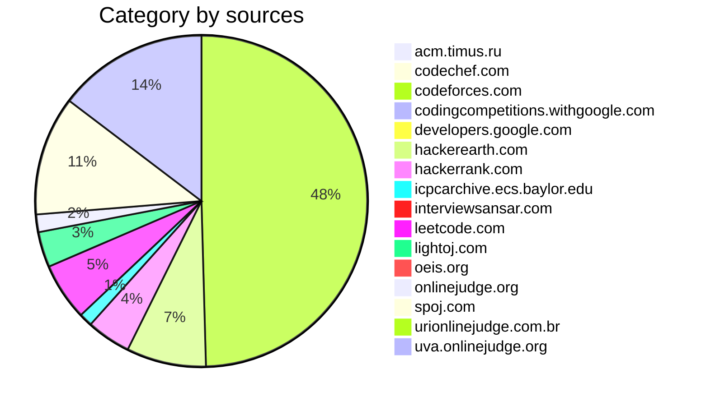

# Problems-Solving
My implementation of useful data structures, algorithms, as well as my solutions to programming puzzles.
```java
Number of problems : 241
- acm.timus.ru : 1
- codechef.com : 2
- codeforces.com : 115
- codingcompetitions.withgoogle.com : 1
- developers.google.com : 1
- hackerearth.com : 18
- hackerrank.com : 10
- icpcarchive.ecs.baylor.edu : 3
- interviewsansar.com : 1
- leetcode.com : 13
- lightoj.com : 8
- oeis.org : 1
- onlinejudge.org : 4
- spoj.com : 27
- urionlinejudge.com.br : 2
- uva.onlinejudge.org : 34
```

### #01knapsack (3)
- [x] DividingCoins [(java)](./Java/DividingCoins.java)
- [x] DivingForGold [(java)](./Java/DivingForGold.java)
- [x] PoloPenguinAndTest [(java)](./Java/PoloPenguinAndTest.java)
### #ad-hoc-1 (3)
- [x] MMass [(java)](./Java/MMass.java)
- [x] StreetParade [(java)](./Java/StreetParade.java)
- [x] Test [(java)](./Java/Test.java)
### #array (2)
- [x] FindtheDuplicateNumber [(cpp)](./C++/FindtheDuplicateNumber.cpp)
- [x] RemoveDuplicatesFromSortedArray [(cpp)](./C++/RemoveDuplicatesFromSortedArray.cpp)
### #backtracking (7)
- [x] BoggleGame [(java)](./Java/BoggleGame.java)
- [x] DiggerOctaves [(java)](./Java/DiggerOctaves.java)
- [x] HammingDistanceProblem [(java)](./Java/HammingDistanceProblem.java)
- [x] Lotto [(java)](./Java/Lotto.java)
- [x] MinimizeAbsoluteDifference [(java)](./Java/MinimizeAbsoluteDifference.java)
- [x] MinimizeAbsoluteDifferenceBetter [(java)](./Java/MinimizeAbsoluteDifferenceBetter.java)
- [x] TheSultanSuccessors [(java)](./Java/TheSultanSuccessors.java)
### #bellman-ford (7)
- [x] EventOrganizer [(cpp)](./C++/EventOrganizer.cpp)
- [x] ExtendedTraffic [(cpp)](./C++/ExtendedTraffic.cpp)
- [x] MilesToChicago [(cpp)](./C++/MilesToChicago.cpp)
- [x] MonkBusinessDay [(cpp)](./C++/MonkBusinessDay.cpp)
- [x] Wonderland [(cpp)](./C++/Wonderland.cpp)
- [x] Wormholes [(cpp)](./C++/Wormholes.cpp)
- [x] XYZZY [(cpp)](./C++/XYZZY.cpp)
### #bfs (18)
- [x] BishuAndHisGirlFriend [(java)](./Java/BishuAndHisGirlFriend.java)
- [x] Cam5 [(java)](./Java/Cam5.java)
- [x] ChristmasTrees [(java)](./Java/ChristmasTrees.java)
- [x] Dhoom [(java)](./Java/Dhoom.java)
- [x] GuiltyPrince [(java)](./Java/GuiltyPrince.java)
- [x] IceCave [(java)](./Java/IceCave.java)
- [x] IceSkating [(java)](./Java/IceSkating.java)
- [x] IsenbaevsNumber [(java)](./Java/IsenbaevsNumber.java)
- [x] KefaAndPark [(java)](./Java/KefaAndPark.java)
- [x] KozeSheep [(java)](./Java/KozeSheep.java)
- [x] MakeMaze [(java)](./Java/MakeMaze.java)
- [x] MiceMaze [(java)](./Java/MiceMaze.java)
- [x] NormalBFS [(java)](./Java/NormalBFS.java)
- [x] Risk [(cpp)](./C++/Risk.cpp)
- [x] ShortedBFS [(java)](./Java/ShortedBFS.java)
- [x] Slick [(java)](./Java/Slick.java)
- [x] TreasureHunter [(java)](./Java/TreasureHunter.java)
- [x] XYZZY [(cpp)](./C++/XYZZY.cpp)
### #binary-search (31)
- [x] AGGRCOW [(java)](./Java/AGGRCOW.java)
- [x] AnotherProblemString [(java)](./Java/AnotherProblemString.java)
- [x] BearAndPrimeNumbers [(java)](./Java/BearAndPrimeNumbers.java)
- [x] BerlandFair [(java)](./Java/BerlandFair.java)
- [x] BerryJam [(java)](./Java/BerryJam.java)
- [x] Books [(java)](./Java/Books.java)
- [x] Candies [(java)](./Java/Candies.java)
- [x] CommonElementInTwoArray [(cpp)](./C++/CommonElementInTwoArray.cpp)
- [x] CreativeSnap [(java)](./Java/CreativeSnap.java)
- [x] DressEmInVests [(java)](./Java/DressEmInVests.java)
- [x] EKO [(java)](./Java/EKO.java)
- [x] EnergyExchange [(java)](./Java/EnergyExchange.java)
- [x] FindtheDuplicateNumber [(cpp)](./C++/FindtheDuplicateNumber.cpp)
- [x] GukiZAndContest [(java)](./Java/GukiZAndContest.java)
- [x] HACKRNDM [(java)](./Java/HACKRNDM.java)
- [x] HanSoloLazerGun [(java)](./Java/HanSoloLazerGun.java)
- [x] KDominantCharacter [(java)](./Java/KDominantCharacter.java)
- [x] Letters [(cpp)](./C++/Letters.cpp)
- [x] Marble [(cpp)](./C++/Marble.cpp) [(java)](./Java/Marble.java)
- [x] Megacity [(java)](./Java/Megacity.java)
- [x] ModifiedGCD [(java)](./Java/ModifiedGCD.java)
- [x] MonkeyAndBamboo [(java)](./Java/MonkeyAndBamboo.java)
- [x] NewYearAndAscentSequence [(java)](./Java/NewYearAndAscentSequence.java)
- [x] Pizzamania [(cpp)](./C++/Pizzamania.cpp) [(java)](./Java/Pizzamania.java)
- [x] PlayboyChimp [(java)](./Java/PlayboyChimp.java)
- [x] QueriesLessEqualElement [(java)](./Java/QueriesLessEqualElement.java)
- [x] ReallyBigNumbers [(java)](./Java/ReallyBigNumbers.java)
- [x] TextEditor [(java)](./Java/TextEditor.java)
- [x] ThreePartsOfArray [(cpp)](./C++/ThreePartsOfArray.cpp)
- [x] VasyaAndString [(cpp)](./C++/VasyaAndString.cpp)
- [x] VasyaBasketball [(java)](./Java/VasyaBasketball.java)
### #binary-search-tree (3)
- [x] DistinctCount [(java)](./Java/DistinctCount.java)
- [x] MinimumLoss [(java)](./Java/MinimumLoss.java)
- [x] MonkAndFriends [(java)](./Java/MonkAndFriends.java)
### #bit-manipulation (13)
- [x] AishAndXOR [(java)](./Java/AishAndXOR.java)
- [x] Array [(java)](./Java/Array.java)
- [x] DiggerOctaves [(java)](./Java/DiggerOctaves.java)
- [x] EscapeNight [(java)](./Java/EscapeNight.java)
- [x] MatteyMultiplication [(java)](./Java/MatteyMultiplication.java)
- [x] MonkBinaryArray [(java)](./Java/MonkBinaryArray.java)
- [x] PoloThePenguinAndTheXOR [(java)](./Java/PoloThePenguinAndTheXOR.java)
- [x] PowerOfTwo [(java)](./Java/PowerOfTwo.java)
- [x] QualificationRounds [(java)](./Java/QualificationRounds.java)
- [x] SamuBirthdayParty [(java)](./Java/SamuBirthdayParty.java) [(java)](./Java/SamuBirthdayParty.java)
- [x] SansaAndXOR [(java)](./Java/SansaAndXOR.java)
- [x] SherlockAndXOR [(java)](./Java/SherlockAndXOR.java)
- [x] XorAndProject [(java)](./Java/XorAndProject.java)
### #brute-force (6)
- [x] AnotherProblemString [(java)](./Java/AnotherProblemString.java)
- [x] HanSoloLazerGun [(java)](./Java/HanSoloLazerGun.java)
- [x] KefaAndFirstSteps [(java)](./Java/KefaAndFirstSteps.java)
- [x] TheSultanSuccessors [(java)](./Java/TheSultanSuccessors.java)
- [x] Thor [(java)](./Java/Thor.java)
- [x] VasyaBasketball [(java)](./Java/VasyaBasketball.java)
### #constructive-algorithms (3)
- [x] BestGift [(java)](./Java/BestGift.java)
- [x] NicholasAndPermutation [(java)](./Java/NicholasAndPermutation.java)
- [x] ProcessingQueries [(java)](./Java/ProcessingQueries.java)
### #deque (1)
- [x] Plugin [(cpp)](./C++/Plugin.cpp) [(java)](./Java/Plugin.java)
### #dfs (22)
- [x] AbcPath [(java)](./Java/AbcPath.java)
- [x] Bipartiteness [(java)](./Java/Bipartiteness.java)
- [x] BishuAndHisGirlFriend [(java)](./Java/BishuAndHisGirlFriend.java)
- [x] Cam5 [(java)](./Java/Cam5.java)
- [x] ColorfulGraph [(java)](./Java/ColorfulGraph.java)
- [x] CoverIt [(cpp)](./C++/CoverIt.cpp)
- [x] Cthulhu [(java)](./Java/Cthulhu.java)
- [x] CyclicComponents [(java)](./Java/CyclicComponents.java)
- [x] DistanceInTree [(java)](./Java/DistanceInTree.java)
- [x] DuduServiceMaker [(java)](./Java/DuduServiceMaker.java)
- [x] FoxAndNames [(java)](./Java/FoxAndNames.java)
- [x] IceCave [(java)](./Java/IceCave.java)
- [x] IceSkating [(java)](./Java/IceSkating.java)
- [x] KefaAndPark [(java)](./Java/KefaAndPark.java)
- [x] KingPath [(java)](./Java/KingPath.java)
- [x] LakesInBerland [(java)](./Java/LakesInBerland.java)
- [x] LastShot [(java)](./Java/LastShot.java)
- [x] LearnLanguages [(java)](./Java/LearnLanguages.java)
- [x] LunarNewYearWander [(java)](./Java/LunarNewYearWander.java)
- [x] NewYearPermutation [(java)](./Java/NewYearPermutation.java)
- [x] OliverAndTheGame [(java)](./Java/OliverAndTheGame.java)
- [x] Queen [(java)](./Java/Queen.java)
### #dijkstra (13)
- [x] AlmostShortestPath [(cpp)](./C++/AlmostShortestPath.cpp) [(java)](./Java/AlmostShortestPath.java)
- [x] AsterixAndObelix [(cpp)](./C++/AsterixAndObelix.cpp)
- [x] Audiophobia [(java)](./Java/Audiophobia.java)
- [x] Boombs [(cpp)](./C++/Boombs.cpp) [(java)](./Java/Boombs.java)
- [x] ChocolateJourney [(java)](./Java/ChocolateJourney.java)
- [x] Commandos [(java)](./Java/Commandos.java)
- [x] CountryRoads [(cpp)](./C++/CountryRoads.cpp) [(java)](./Java/CountryRoads.java)
- [x] MiceMaze [(java)](./Java/MiceMaze.java)
- [x] PhilosophersStone [(java)](./Java/PhilosophersStone.java)
- [x] SendingEmail [(cpp)](./C++/SendingEmail.cpp)
- [x] ShortestPath [(java)](./Java/ShortestPath.java)
- [x] TravellingCost [(java)](./Java/TravellingCost.java)
- [x] WordTransformation [(cpp)](./C++/WordTransformation.cpp)
### #divide-and-conquer (9)
- [x] BeautifulArray [(java)](./Java/BeautifulArray.java)
- [x] BitMaps [(java)](./Java/BitMaps.java)
- [x] Candies [(java)](./Java/Candies.java)
- [x] CreativeSnap [(java)](./Java/CreativeSnap.java)
- [x] DistanceInTree [(java)](./Java/DistanceInTree.java)
- [x] ExaminationPapers [(java)](./Java/ExaminationPapers.java)
- [x] PaintingFence [(java)](./Java/PaintingFence.java)
- [x] TheClosestPairProblem [(java)](./Java/TheClosestPairProblem.java)
- [x] TrickyFunction [(java)](./Java/TrickyFunction.java)
### #dsu (16)
- [x] ColorfulGraph [(java)](./Java/ColorfulGraph.java)
- [x] CoverIt [(cpp)](./C++/CoverIt.cpp)
- [x] Cthulhu [(java)](./Java/Cthulhu.java)
- [x] CyclicComponents [(java)](./Java/CyclicComponents.java)
- [x] Forest [(java)](./Java/Forest.java)
- [x] Freckles [(java)](./Java/Freckles.java)
- [x] Friends [(java)](./Java/Friends.java)
- [x] GraphConnectivity [(java)](./Java/GraphConnectivity.java)
- [x] IceSkating [(java)](./Java/IceSkating.java)
- [x] LakesInBerland [(java)](./Java/LakesInBerland.java)
- [x] LearnLanguages [(java)](./Java/LearnLanguages.java)
- [x] MakeItConnected [(java)](./Java/MakeItConnected.java)
- [x] NewYearPermutation [(java)](./Java/NewYearPermutation.java)
- [x] UbiquitousReligions [(java)](./Java/UbiquitousReligions.java)
- [x] VirtualFriends [(java)](./Java/VirtualFriends.java)
- [x] War [(java)](./Java/War.java)
### #dynamic-programming (48)
- [x] AdvancedFruits [(java)](./Java/AdvancedFruits.java)
- [x] Aibohphobia [(java)](./Java/Aibohphobia.java)
- [x] Alphacode [(java)](./Java/Alphacode.java)
- [x] AnotherProblemString [(java)](./Java/AnotherProblemString.java)
- [x] ApproximatingAConstantRange [(java)](./Java/ApproximatingAConstantRange.java)
- [x] BasketballExercise [(java)](./Java/BasketballExercise.java)
- [x] BeautifulArray [(java)](./Java/BeautifulArray.java)
- [x] BeautifulPeople [(java)](./Java/BeautifulPeople.java)
- [x] BytelandianGoldCoins [(java)](./Java/BytelandianGoldCoins.java)
- [x] Compromise [(java)](./Java/Compromise.java)
- [x] CowAndMessage [(java)](./Java/CowAndMessage.java)
- [x] CrossCountry [(java)](./Java/CrossCountry.java)
- [x] DNASequences [(java)](./Java/DNASequences.java)
- [x] DistanceInTree [(java)](./Java/DistanceInTree.java)
- [x] DividingCoins [(java)](./Java/DividingCoins.java)
- [x] DivingForGold [(java)](./Java/DivingForGold.java)
- [x] Equalize [(java)](./Java/Equalize.java)
- [x] EvilUnderscores [(java)](./Java/EvilUnderscores.java)
- [x] Garland [(java)](./Java/Garland.java)
- [x] GoodSequences [(java)](./Java/GoodSequences.java)
- [x] HardProblem [(java)](./Java/HardProblem.java) [(java)](./Java/HardProblem.java)
- [x] IngenuousCubrency [(java)](./Java/IngenuousCubrency.java)
- [x] KbasedNumbers [(java)](./Java/KbasedNumbers.java)
- [x] KefaAndFirstSteps [(java)](./Java/KefaAndFirstSteps.java)
- [x] Letter [(java)](./Java/Letter.java)
- [x] LoveCalculator [(java)](./Java/LoveCalculator.java)
- [x] MancunianKOrderedLCS [(java)](./Java/MancunianKOrderedLCS.java)
- [x] PaintingFence [(java)](./Java/PaintingFence.java)
- [x] PalindromicCharacteristics [(java)](./Java/PalindromicCharacteristics.java)
- [x] PhilosophersStone [(java)](./Java/PhilosophersStone.java)
- [x] PickTheSticks [(java)](./Java/PickTheSticks.java) [(java)](./Java/PickTheSticks.java)
- [x] PoloPenguinAndTest [(java)](./Java/PoloPenguinAndTest.java)
- [x] PrinceAndPrincess [(java)](./Java/PrinceAndPrincess.java)
- [x] RecyclingBottles [(java)](./Java/RecyclingBottles.java)
- [x] SAMER08DDNASequences [(java)](./Java/SAMER08DDNASequences.java)
- [x] SamuBirthdayParty [(java)](./Java/SamuBirthdayParty.java)
- [x] SansaAndXOR [(java)](./Java/SansaAndXOR.java)
- [x] ScubaDiver [(java)](./Java/ScubaDiver.java)
- [x] TestingTheCATCHER [(java)](./Java/TestingTheCATCHER.java)
- [x] TheFairNutAndString [(java)](./Java/TheFairNutAndString.java)
- [x] TheTowerOfBabylon [(java)](./Java/TheTowerOfBabylon.java)
- [x] TheValuesYouCanMake [(java)](./Java/TheValuesYouCanMake.java)
- [x] Trainsorting [(java)](./Java/Trainsorting.java)
- [x] TreasureHunter [(java)](./Java/TreasureHunter.java)
- [x] TreasureIsland [(java)](./Java/TreasureIsland.java)
- [x] TwoArrays [(java)](./Java/TwoArrays.java)
- [x] VasyaAndString [(cpp)](./C++/VasyaAndString.cpp)
- [x] WavioSequence [(java)](./Java/WavioSequence.java)
### #floyd-warshall (4)
- [x] Arbitrage [(cpp)](./C++/Arbitrage.cpp)
- [x] MeetingProf [(cpp)](./C++/MeetingProf.cpp)
- [x] SocialnePossibleFriends [(java)](./Java/SocialnePossibleFriends.java)
- [x] ThunderMountain [(cpp)](./C++/ThunderMountain.cpp)
### #geometry (2)
- [x] HanSoloLazerGun [(java)](./Java/HanSoloLazerGun.java)
- [x] TrickyFunction [(java)](./Java/TrickyFunction.java)
### #graph (6)
- [x] Bipartiteness [(java)](./Java/Bipartiteness.java)
- [x] ChristmasTrees [(java)](./Java/ChristmasTrees.java)
- [x] ColorfulGraph [(java)](./Java/ColorfulGraph.java)
- [x] FoxAndNames [(java)](./Java/FoxAndNames.java)
- [x] OliverAndTheGame [(java)](./Java/OliverAndTheGame.java)
- [x] TravellingCost [(java)](./Java/TravellingCost.java)
### #greedy (36)
- [x] AliceBobChocolate [(java)](./Java/AliceBobChocolate.java)
- [x] BeautifulArray [(java)](./Java/BeautifulArray.java)
- [x] BerlandFair [(java)](./Java/BerlandFair.java)
- [x] BestTimeToBuyandSellStockII [(cpp)](./C++/BestTimeToBuyandSellStockII.cpp) [(py)](./Python/BestTimeToBuyandSellStockII.py)
- [x] Brutality [(cpp)](./C++/Brutality.cpp) [(java)](./Java/Brutality.java)
- [x] BuildingPermutation [(java)](./Java/BuildingPermutation.java)
- [x] BusinessTrip [(java)](./Java/BusinessTrip.java)
- [x] Candies [(java)](./Java/Candies.java)
- [x] ChristmasTrees [(java)](./Java/ChristmasTrees.java)
- [x] DiverseGarland [(java)](./Java/DiverseGarland.java)
- [x] DressEmInVests [(java)](./Java/DressEmInVests.java)
- [x] Equalize [(java)](./Java/Equalize.java)
- [x] Garland [(java)](./Java/Garland.java)
- [x] GeorgeAndRound [(java)](./Java/GeorgeAndRound.java)
- [x] LakesInBerland [(java)](./Java/LakesInBerland.java)
- [x] LunarNewYearWander [(java)](./Java/LunarNewYearWander.java)
- [x] MakeItConnected [(java)](./Java/MakeItConnected.java)
- [x] Megacity [(java)](./Java/Megacity.java)
- [x] NewYearParties [(java)](./Java/NewYearParties.java)
- [x] NewYearPermutation [(java)](./Java/NewYearPermutation.java)
- [x] NumberDivision [(java)](./Java/NumberDivision.java)
- [x] ORMatrix [(java)](./Java/ORMatrix.java)
- [x] OldBerlandLanguage [(java)](./Java/OldBerlandLanguage.java)
- [x] PaintingFence [(java)](./Java/PaintingFence.java)
- [x] PetyaAndCatacombs [(java)](./Java/PetyaAndCatacombs.java)
- [x] RegularBracketSequence [(java)](./Java/RegularBracketSequence.java)
- [x] RomaAndChangingSigns [(java)](./Java/RomaAndChangingSigns.java)
- [x] SerejaAndDima [(java)](./Java/SerejaAndDima.java)
- [x] Stages [(java)](./Java/Stages.java)
- [x] TanyaAndPostcard [(java)](./Java/TanyaAndPostcard.java)
- [x] Taxi [(java)](./Java/Taxi.java)
- [x] TheNumberOnBoard [(java)](./Java/TheNumberOnBoard.java)
- [x] UsbAndPS [(cpp)](./C++/UsbAndPS.cpp) [(java)](./Java/UsbAndPS.java)
- [x] WineTradingInGergovia [(java)](./Java/WineTradingInGergovia.java)
- [x] easyExamInBerSU [(cpp)](./C++/easyExamInBerSU.cpp)
- [x] hardExamInBerSU [(cpp)](./C++/hardExamInBerSU.cpp) [(cpp)](./C++/hardExamInBerSU.cpp)
### #hash-table (13)
- [x] CampSchedule [(java)](./Java/CampSchedule.java)
- [x] CheckTranscription [(java)](./Java/CheckTranscription.java)
- [x] CommonElementInTwoArray [(cpp)](./C++/CommonElementInTwoArray.cpp)
- [x] FindTwoNumbersWithPredictedSum [(cpp)](./C++/FindTwoNumbersWithPredictedSum.cpp)
- [x] GoodSubstrings [(java)](./Java/GoodSubstrings.java)
- [x] KingPath [(java)](./Java/KingPath.java)
- [x] LengthOfLongestSubString [(cpp)](./C++/LengthOfLongestSubString.cpp) [(py)](./Python/LengthOfLongestSubString.py)
- [x] PalindromicCharacteristics [(java)](./Java/PalindromicCharacteristics.java)
- [x] PetyaAndCatacombs [(java)](./Java/PetyaAndCatacombs.java)
- [x] RemoveDuplicatesFromSortedArray [(cpp)](./C++/RemoveDuplicatesFromSortedArray.cpp)
- [x] SuffixEqualPrefix [(java)](./Java/SuffixEqualPrefix.java)
- [x] TheMonkAndPrateek [(java)](./Java/TheMonkAndPrateek.java) [(java)](./Java/TheMonkAndPrateek.java)
- [x] WattoAndMechanism [(java)](./Java/WattoAndMechanism.java)
### #heap (6)
- [x] AddAll [(java)](./Java/AddAll.java)
- [x] Median [(cpp)](./C++/Median.cpp)
- [x] MonkAndMultiplication [(java)](./Java/MonkAndMultiplication.java)
- [x] QHeap1 [(java)](./Java/QHeap1.java)
- [x] RoyTrendingTopic [(java)](./Java/RoyTrendingTopic.java)
- [x] YourQueue [(java)](./Java/YourQueue.java)
### #implementation (44)
- [x] AddTwoNumbers [(cpp)](./C++/AddTwoNumbers.cpp) [(py)](./Python/AddTwoNumbers.py)
- [x] AirConditioner [(java)](./Java/AirConditioner.java)
- [x] BalanceBrackets [(cpp)](./C++/BalanceBrackets.cpp)
- [x] BalancedSubstring [(java)](./Java/BalancedSubstring.java)
- [x] BearAndGame [(java)](./Java/BearAndGame.java)
- [x] BearAndPrimeNumbers [(java)](./Java/BearAndPrimeNumbers.java)
- [x] BerryJam [(java)](./Java/BerryJam.java)
- [x] BestGift [(java)](./Java/BestGift.java)
- [x] BestTimeToBuyandSellStockII [(cpp)](./C++/BestTimeToBuyandSellStockII.cpp) [(py)](./Python/BestTimeToBuyandSellStockII.py)
- [x] BigSegment [(java)](./Java/BigSegment.java)
- [x] Books [(java)](./Java/Books.java)
- [x] BusinessTrip [(java)](./Java/BusinessTrip.java)
- [x] Buttons [(java)](./Java/Buttons.java)
- [x] CalculatingFunction [(java)](./Java/CalculatingFunction.java)
- [x] CamelCase [(java)](./Java/CamelCase.java)
- [x] CombinationLock [(java)](./Java/CombinationLock.java)
- [x] EhabAndSubstraction [(java)](./Java/EhabAndSubstraction.java)
- [x] FashionInBerland [(java)](./Java/FashionInBerland.java)
- [x] FibsieveFantabulous [(java)](./Java/FibsieveFantabulous.java)
- [x] GukiZAndContest [(java)](./Java/GukiZAndContest.java)
- [x] HardwoodSpecies [(java)](./Java/HardwoodSpecies.java)
- [x] KefaAndFirstSteps [(java)](./Java/KefaAndFirstSteps.java)
- [x] LittleDeepuAndArray [(java)](./Java/LittleDeepuAndArray.java)
- [x] MathExpression [(cpp)](./C++/MathExpression.cpp)
- [x] MessageSpreading [(java)](./Java/MessageSpreading.java)
- [x] NicholasAndPermutation [(java)](./Java/NicholasAndPermutation.java)
- [x] NumberDivision [(java)](./Java/NumberDivision.java)
- [x] Pangram [(cpp)](./C++/Pangram.cpp)
- [x] Pipes [(java)](./Java/Pipes.java)
- [x] Plugin [(cpp)](./C++/Plugin.cpp) [(java)](./Java/Plugin.java)
- [x] QualificationRounds [(java)](./Java/QualificationRounds.java)
- [x] RectangleOverlap [(cpp)](./C++/RectangleOverlap.cpp)
- [x] RoundTableKnights [(java)](./Java/RoundTableKnights.java)
- [x] Run-lengthEncoding [(cpp)](./C++/Run-lengthEncoding.cpp)
- [x] Semifinals [(java)](./Java/Semifinals.java)
- [x] SerejaAndDima [(java)](./Java/SerejaAndDima.java)
- [x] SortTheArray [(java)](./Java/SortTheArray.java)
- [x] Stages [(java)](./Java/Stages.java)
- [x] Taxi [(java)](./Java/Taxi.java)
- [x] TernaryXOR [(java)](./Java/TernaryXOR.java)
- [x] Thor [(java)](./Java/Thor.java)
- [x] VanyaAndFence [(java)](./Java/VanyaAndFence.java)
- [x] VasyaAndMultisets [(java)](./Java/VasyaAndMultisets.java)
- [x] myPow [(cpp)](./C++/myPow.cpp) [(py)](./Python/myPow.py)
### #kmp (6)
- [x] FileRecoverTesting [(java)](./Java/FileRecoverTesting.java)
- [x] FindStringRoots [(java)](./Java/FindStringRoots.java)
- [x] GaintAndSifat [(java)](./Java/GaintAndSifat.java)
- [x] MUHAndCubeWalls [(java)](./Java/MUHAndCubeWalls.java)
- [x] Password [(java)](./Java/Password.java)
- [x] TextEditor [(java)](./Java/TextEditor.java)
### #knapsack (2)
- [x] PickTheSticks [(java)](./Java/PickTheSticks.java)
- [x] ScubaDiver [(java)](./Java/ScubaDiver.java)
### #lcs (8)
- [x] AdvancedFruits [(java)](./Java/AdvancedFruits.java)
- [x] Aibohphobia [(java)](./Java/Aibohphobia.java)
- [x] Compromise [(java)](./Java/Compromise.java)
- [x] CrossCountry [(java)](./Java/CrossCountry.java)
- [x] DNASequences [(java)](./Java/DNASequences.java)
- [x] LoveCalculator [(java)](./Java/LoveCalculator.java)
- [x] MancunianKOrderedLCS [(java)](./Java/MancunianKOrderedLCS.java)
- [x] SAMER08DDNASequences [(java)](./Java/SAMER08DDNASequences.java)
### #linked-list (1)
- [x] AddTwoNumbers [(cpp)](./C++/AddTwoNumbers.cpp) [(py)](./Python/AddTwoNumbers.py)
### #lis (6)
- [x] BeautifulPeople [(java)](./Java/BeautifulPeople.java)
- [x] PrinceAndPrincess [(java)](./Java/PrinceAndPrincess.java)
- [x] TestingTheCATCHER [(java)](./Java/TestingTheCATCHER.java)
- [x] TheTowerOfBabylon [(java)](./Java/TheTowerOfBabylon.java)
- [x] Trainsorting [(java)](./Java/Trainsorting.java)
- [x] WavioSequence [(java)](./Java/WavioSequence.java)
### #map (4)
- [x] FindTwoNumbersWithPredictedSum [(cpp)](./C++/FindTwoNumbersWithPredictedSum.cpp)
- [x] MonkAndFriends [(java)](./Java/MonkAndFriends.java)
- [x] RemoveDuplicatesFromSortedArray [(cpp)](./C++/RemoveDuplicatesFromSortedArray.cpp)
- [x] Towers [(java)](./Java/Towers.java)
### #math (15)
- [x] AddTwoNumbers [(cpp)](./C++/AddTwoNumbers.cpp) [(py)](./Python/AddTwoNumbers.py)
- [x] Buttons [(java)](./Java/Buttons.java)
- [x] CalculatingFunction [(java)](./Java/CalculatingFunction.java)
- [x] CowAndMessage [(java)](./Java/CowAndMessage.java)
- [x] FindNumbersContainingOne [(cpp)](./C++/FindNumbersContainingOne.cpp) [(py)](./Python/FindNumbersContainingOne.py)
- [x] HanSoloLazerGun [(java)](./Java/HanSoloLazerGun.java)
- [x] MatteyMultiplication [(java)](./Java/MatteyMultiplication.java)
- [x] NewYearPermutation [(java)](./Java/NewYearPermutation.java)
- [x] NumberDivision [(java)](./Java/NumberDivision.java)
- [x] RectangleOverlap [(cpp)](./C++/RectangleOverlap.cpp)
- [x] SendATable [(java)](./Java/SendATable.java)
- [x] SherlockAndXOR [(java)](./Java/SherlockAndXOR.java)
- [x] SoldierBananas [(cpp)](./C++/SoldierBananas.cpp)
- [x] TwoArrays [(java)](./Java/TwoArrays.java)
- [x] hardExamInBerSU [(cpp)](./C++/hardExamInBerSU.cpp)
### #mst (4)
- [x] CobbledStreets [(java)](./Java/CobbledStreets.java)
- [x] Freckles [(java)](./Java/Freckles.java)
- [x] MST [(java)](./Java/MST.java)
- [x] MakeItConnected [(java)](./Java/MakeItConnected.java)
### #number-theory (13)
- [x] AnagrammaticPrimes [(java)](./Java/AnagrammaticPrimes.java)
- [x] BoxesOfChocolates [(java)](./Java/BoxesOfChocolates.java)
- [x] DrazilAndHisHappyFriends [(java)](./Java/DrazilAndHisHappyFriends.java)
- [x] FloorAndCeil [(java)](./Java/FloorAndCeil.java)
- [x] IrreducibleBasicFractions [(java)](./Java/IrreducibleBasicFractions.java)
- [x] LargestPrimeDivisor [(java)](./Java/LargestPrimeDivisor.java)
- [x] MatteyMultiplication [(java)](./Java/MatteyMultiplication.java)
- [x] ModifiedGCD [(java)](./Java/ModifiedGCD.java)
- [x] Ones [(java)](./Java/Ones.java)
- [x] PalindromicSeries [(java)](./Java/PalindromicSeries.java)
- [x] PrimeCuts [(java)](./Java/PrimeCuts.java)
- [x] ProblemMakesProblem [(java)](./Java/ProblemMakesProblem.java)
- [x] SendATable [(java)](./Java/SendATable.java)
### #optimized (1)
- [x] LoveCalculator [(java)](./Java/LoveCalculator.java)
### #pointer (1)
- [x] unknow_test [(cpp)](./C++/unknow_test.cpp)
### #prim (8)
- [x] ACMContestBlackout [(java)](./Java/ACMContestBlackout.java)
- [x] Audiophobia [(java)](./Java/Audiophobia.java)
- [x] CobbledStreets [(java)](./Java/CobbledStreets.java)
- [x] ConnectCampus [(java)](./Java/ConnectCampus.java)
- [x] MST [(java)](./Java/MST.java)
- [x] PrimSpecialSubtree [(java)](./Java/PrimSpecialSubtree.java)
- [x] RoadConstruction [(java)](./Java/RoadConstruction.java)
- [x] SimulateNetwork [(java)](./Java/SimulateNetwork.java)
### #priority-queue (9)
- [x] AddAll [(java)](./Java/AddAll.java)
- [x] GuessDequePriorityQueue [(cpp)](./C++/GuessDequePriorityQueue.cpp) [(java)](./Java/GuessDequePriorityQueue.java)
- [x] Median [(cpp)](./C++/Median.cpp)
- [x] MonkAndMultiplication [(java)](./Java/MonkAndMultiplication.java)
- [x] PrinterQueue [(cpp)](./C++/PrinterQueue.cpp)
- [x] QHeap1 [(java)](./Java/QHeap1.java)
- [x] RoyTrendingTopic [(java)](./Java/RoyTrendingTopic.java)
- [x] easyExamInBerSU [(cpp)](./C++/easyExamInBerSU.cpp)
- [x] hardExamInBerSU [(cpp)](./C++/hardExamInBerSU.cpp)
### #queue (9)
- [x] FerryLoadingIII [(java)](./Java/FerryLoadingIII.java)
- [x] GuessDequePriorityQueue [(cpp)](./C++/GuessDequePriorityQueue.cpp) [(java)](./Java/GuessDequePriorityQueue.java)
- [x] PrinterQueue [(cpp)](./C++/PrinterQueue.cpp)
- [x] ProcessingQueries [(java)](./Java/ProcessingQueries.java)
- [x] StreetParade [(java)](./Java/StreetParade.java)
- [x] Test [(java)](./Java/Test.java)
- [x] Thor [(java)](./Java/Thor.java)
- [x] ThrowingCard [(java)](./Java/ThrowingCard.java)
- [x] YourQueue [(java)](./Java/YourQueue.java)
### #recursion (3)
- [x] AbcPath [(java)](./Java/AbcPath.java)
- [x] MathExpression [(cpp)](./C++/MathExpression.cpp)
- [x] myPow [(cpp)](./C++/myPow.cpp) [(py)](./Python/myPow.py)
### #refactor (4)
- [x] BasketballExercise [(java)](./Java/BasketballExercise.java)
- [x] DrazilAndHisHappyFriends [(java)](./Java/DrazilAndHisHappyFriends.java)
- [x] LoveCalculator [(java)](./Java/LoveCalculator.java)
- [x] PoloThePenguinAndTheXOR [(java)](./Java/PoloThePenguinAndTheXOR.java)
### #segment-tree (6)
- [x] Brackets [(java)](./Java/Brackets.java)
- [x] CircularRMQ [(java)](./Java/CircularRMQ.java)
- [x] CuriousRobinHood [(java)](./Java/CuriousRobinHood.java)
- [x] IntervalProduct [(java)](./Java/IntervalProduct.java)
- [x] LittleDeepuAndArray [(java)](./Java/LittleDeepuAndArray.java)
- [x] XeniaAndBitOperations [(java)](./Java/XeniaAndBitOperations.java)
### #shortest-path (24)
- [x] AlmostShortestPath [(cpp)](./C++/AlmostShortestPath.cpp) [(java)](./Java/AlmostShortestPath.java)
- [x] Arbitrage [(cpp)](./C++/Arbitrage.cpp)
- [x] AsterixAndObelix [(cpp)](./C++/AsterixAndObelix.cpp)
- [x] Audiophobia [(java)](./Java/Audiophobia.java)
- [x] Boombs [(cpp)](./C++/Boombs.cpp) [(java)](./Java/Boombs.java)
- [x] ChocolateJourney [(java)](./Java/ChocolateJourney.java)
- [x] Commandos [(java)](./Java/Commandos.java)
- [x] CountryRoads [(cpp)](./C++/CountryRoads.cpp) [(java)](./Java/CountryRoads.java)
- [x] CoverIt [(cpp)](./C++/CoverIt.cpp)
- [x] EventOrganizer [(cpp)](./C++/EventOrganizer.cpp)
- [x] KingPath [(java)](./Java/KingPath.java)
- [x] LunarNewYearWander [(java)](./Java/LunarNewYearWander.java)
- [x] MeetingProf [(cpp)](./C++/MeetingProf.cpp)
- [x] MiceMaze [(java)](./Java/MiceMaze.java)
- [x] MilesToChicago [(cpp)](./C++/MilesToChicago.cpp)
- [x] MonkBusinessDay [(cpp)](./C++/MonkBusinessDay.cpp)
- [x] NormalBFS [(java)](./Java/NormalBFS.java)
- [x] SendingEmail [(cpp)](./C++/SendingEmail.cpp)
- [x] ShortestPath [(java)](./Java/ShortestPath.java)
- [x] ThunderMountain [(cpp)](./C++/ThunderMountain.cpp)
- [x] Wonderland [(cpp)](./C++/Wonderland.cpp)
- [x] WordTransformation [(cpp)](./C++/WordTransformation.cpp)
- [x] Wormholes [(cpp)](./C++/Wormholes.cpp)
- [x] XYZZY [(cpp)](./C++/XYZZY.cpp)
### #simple-way (2)
- [x] LoveCalculator [(java)](./Java/LoveCalculator.java)
- [x] Ones [(java)](./Java/Ones.java)
### #slicing-window (1)
- [x] LengthOfLongestSubString [(cpp)](./C++/LengthOfLongestSubString.cpp) [(py)](./Python/LengthOfLongestSubString.py)
### #sorting (25)
- [x] Arrays [(java)](./Java/Arrays.java)
- [x] BigSegment [(java)](./Java/BigSegment.java)
- [x] Brutality [(cpp)](./C++/Brutality.cpp) [(java)](./Java/Brutality.java)
- [x] BuildingPermutation [(java)](./Java/BuildingPermutation.java)
- [x] BusinessTrip [(java)](./Java/BusinessTrip.java)
- [x] Chores [(java)](./Java/Chores.java)
- [x] CommonElementInTwoArray [(cpp)](./C++/CommonElementInTwoArray.cpp)
- [x] DevuDumbGuy [(cpp)](./C++/DevuDumbGuy.cpp)
- [x] EhabAndSubstraction [(java)](./Java/EhabAndSubstraction.java)
- [x] EightPointSets [(java)](./Java/EightPointSets.java)
- [x] GukiZAndContest [(java)](./Java/GukiZAndContest.java)
- [x] MUHImportantThings [(java)](./Java/MUHImportantThings.java)
- [x] NewYearAndAscentSequence [(java)](./Java/NewYearAndAscentSequence.java)
- [x] NewYearPermutation [(java)](./Java/NewYearPermutation.java)
- [x] NumberDivision [(java)](./Java/NumberDivision.java)
- [x] QueriesLessEqualElement [(java)](./Java/QueriesLessEqualElement.java)
- [x] RomaAndChangingSigns [(java)](./Java/RomaAndChangingSigns.java)
- [x] RoyTrendingTopic [(java)](./Java/RoyTrendingTopic.java)
- [x] Semifinals [(java)](./Java/Semifinals.java)
- [x] SortTheArray [(java)](./Java/SortTheArray.java)
- [x] Stages [(java)](./Java/Stages.java)
- [x] Towers [(java)](./Java/Towers.java)
- [x] UsbAndPS [(cpp)](./C++/UsbAndPS.cpp) [(java)](./Java/UsbAndPS.java)
- [x] VasyaBasketball [(java)](./Java/VasyaBasketball.java)
- [x] easyExamInBerSU [(cpp)](./C++/easyExamInBerSU.cpp)
### #special-problem (2)
- [x] ProcessingQueries [(java)](./Java/ProcessingQueries.java)
- [x] Taxi [(java)](./Java/Taxi.java)
### #stack (9)
- [x] BalanceBrackets [(cpp)](./C++/BalanceBrackets.cpp)
- [x] CompilersParsers [(java)](./Java/CompilersParsers.java)
- [x] GuessDequePriorityQueue [(cpp)](./C++/GuessDequePriorityQueue.cpp) [(java)](./Java/GuessDequePriorityQueue.java)
- [x] MMass [(java)](./Java/MMass.java)
- [x] ParenthesesBalance [(cpp)](./C++/ParenthesesBalance.cpp) [(java)](./Java/ParenthesesBalance.java)
- [x] RegularBracketSequence [(java)](./Java/RegularBracketSequence.java)
- [x] StreetParade [(java)](./Java/StreetParade.java)
- [x] Test [(java)](./Java/Test.java)
- [x] TransformExpression [(java)](./Java/TransformExpression.java)
### #string (11)
- [x] CampSchedule [(java)](./Java/CampSchedule.java)
- [x] CheckTranscription [(java)](./Java/CheckTranscription.java)
- [x] HardProblem [(java)](./Java/HardProblem.java)
- [x] LengthOfLongestSubString [(cpp)](./C++/LengthOfLongestSubString.cpp) [(py)](./Python/LengthOfLongestSubString.py)
- [x] PalindromicCharacteristics [(java)](./Java/PalindromicCharacteristics.java)
- [x] Pangram [(cpp)](./C++/Pangram.cpp)
- [x] SearchEngine [(java)](./Java/SearchEngine.java)
- [x] SuffixEqualPrefix [(java)](./Java/SuffixEqualPrefix.java)
- [x] TanyaAndPostcard [(java)](./Java/TanyaAndPostcard.java)
- [x] VasyaAndString [(cpp)](./C++/VasyaAndString.cpp)
- [x] WattoAndMechanism [(java)](./Java/WattoAndMechanism.java)
### #todo (19)
- [ ] BeautifulArray [(java)](./Java/BeautifulArray.java)
- [ ] ColorfulGraph [(java)](./Java/ColorfulGraph.java)
- [ ] DNASequences [(java)](./Java/DNASequences.java)
- [ ] DiccionarioPortunol [(cpp)](./C++/DiccionarioPortunol.cpp) [(java)](./Java/DiccionarioPortunol.java)
- [ ] DiverseGarland [(java)](./Java/DiverseGarland.java)
- [ ] DrazilAndHisHappyFriends [(java)](./Java/DrazilAndHisHappyFriends.java)
- [ ] EvilUnderscores [(java)](./Java/EvilUnderscores.java)
- [ ] FerryLoadingIII [(java)](./Java/FerryLoadingIII.java)
- [ ] Forest [(java)](./Java/Forest.java)
- [ ] Garland [(java)](./Java/Garland.java)
- [ ] HardProblem [(java)](./Java/HardProblem.java)
- [ ] LoveCalculator [(java)](./Java/LoveCalculator.java)
- [ ] MinimizeAbsoluteDifferenceBetter [(java)](./Java/MinimizeAbsoluteDifferenceBetter.java)
- [ ] PoloThePenguinAndTheXOR [(java)](./Java/PoloThePenguinAndTheXOR.java)
- [ ] Test [(java)](./Java/Test.java)
- [ ] ThreePathsOnTree [(java)](./Java/ThreePathsOnTree.java)
- [ ] TreasureIsland [(java)](./Java/TreasureIsland.java)
- [ ] TwoArrays [(java)](./Java/TwoArrays.java)
- [ ] VasyaAndMultisets [(java)](./Java/VasyaAndMultisets.java)
### #topological-sort (8)
- [x] AnswerBoss [(java)](./Java/AnswerBoss.java)
- [x] Beverages [(java)](./Java/Beverages.java)
- [x] DuelingPhilosophersProblem [(java)](./Java/DuelingPhilosophersProblem.java)
- [x] FoxAndNames [(java)](./Java/FoxAndNames.java)
- [x] Hierarchy [(java)](./Java/Hierarchy.java)
- [x] LonelyIsland [(java)](./Java/LonelyIsland.java)
- [x] RareOrder [(java)](./Java/RareOrder.java)
- [x] TopologicalSortingKahn [(java)](./Java/TopologicalSortingKahn.java)
### #tree (2)
- [x] Bipartiteness [(java)](./Java/Bipartiteness.java)
- [x] OldBerlandLanguage [(java)](./Java/OldBerlandLanguage.java)
### #trie (8)
- [x] ConsistencyChecker [(cpp)](./C++/ConsistencyChecker.cpp) [(java)](./Java/ConsistencyChecker.java)
- [x] Contact [(java)](./Java/Contact.java)
- [x] DNAPrefix [(java)](./Java/DNAPrefix.java)
- [x] DiccionarioPortunol [(cpp)](./C++/DiccionarioPortunol.cpp) [(java)](./Java/DiccionarioPortunol.java)
- [x] NoPrefixSet [(java)](./Java/NoPrefixSet.java)
- [x] OldBerlandLanguage [(java)](./Java/OldBerlandLanguage.java)
- [x] PhoneList [(java)](./Java/PhoneList.java)
- [x] SearchEngine [(java)](./Java/SearchEngine.java)
### #two-pointer (23)
- [x] AirConditioner [(java)](./Java/AirConditioner.java)
- [x] AliceBobChocolate [(java)](./Java/AliceBobChocolate.java)
- [x] AnotherProblemString [(java)](./Java/AnotherProblemString.java)
- [x] ApproximatingAConstantRange [(java)](./Java/ApproximatingAConstantRange.java)
- [x] Array [(java)](./Java/Array.java)
- [x] Books [(java)](./Java/Books.java)
- [x] Brutality [(cpp)](./C++/Brutality.cpp) [(java)](./Java/Brutality.java)
- [x] CommonElementInTwoArray [(cpp)](./C++/CommonElementInTwoArray.cpp)
- [x] DressEmInVests [(java)](./Java/DressEmInVests.java)
- [x] FindtheDuplicateNumber [(cpp)](./C++/FindtheDuplicateNumber.cpp)
- [x] FoePairs [(cpp)](./C++/FoePairs.cpp) [(java)](./Java/FoePairs.java)
- [x] GeorgeAndRound [(java)](./Java/GeorgeAndRound.java)
- [x] HACKRNDM [(java)](./Java/HACKRNDM.java)
- [x] KDominantCharacter [(java)](./Java/KDominantCharacter.java)
- [x] LengthOfLongestSubString [(cpp)](./C++/LengthOfLongestSubString.cpp) [(py)](./Python/LengthOfLongestSubString.py)
- [x] Letters [(cpp)](./C++/Letters.cpp)
- [x] ProcessingQueries [(java)](./Java/ProcessingQueries.java)
- [x] QueriesLessEqualElement [(java)](./Java/QueriesLessEqualElement.java)
- [x] SerejaAndDima [(java)](./Java/SerejaAndDima.java)
- [x] ThreePartsOfArray [(cpp)](./C++/ThreePartsOfArray.cpp)
- [x] UsbAndPS [(cpp)](./C++/UsbAndPS.cpp) [(java)](./Java/UsbAndPS.java)
- [x] VasyaAndString [(cpp)](./C++/VasyaAndString.cpp)
- [x] VasyaBasketball [(java)](./Java/VasyaBasketball.java)
